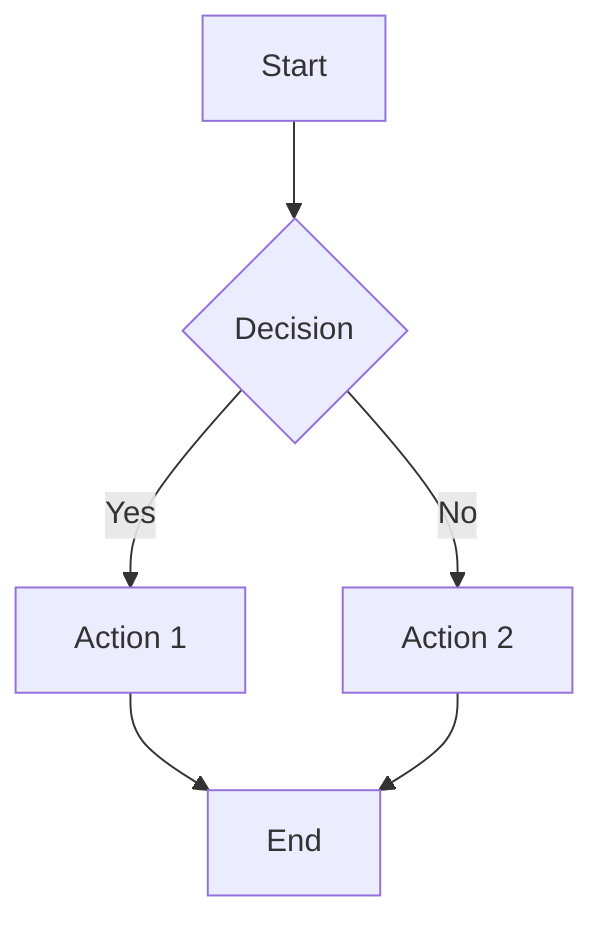

# Documentation Placeholders

Bu dosya, dokümantasyonda doldurulması gereken tüm placeholder'ları listeler.

## Dizin Yapısı

```
docs-site/public/docs/images/
├── screenshots/
│   ├── s01-installation.png
│   ├── s02-auth.png
│   ├── s03-tui-main.png
│   ├── s04-model-dialog.png
│   ├── s05-provider-dialog.png
│   ├── s06-permission-prompt.png
│   ├── s07-plan-mode.png
│   ├── s08-slash-menu.png
│   ├── s09-agent-select.png
│   ├── s10-mcp-tools.png
│   ├── s11-tool-list.png
│   ├── s13-config-structure.png
│   └── s14-hook-block.png
├── gifs/
│   ├── g01-first-run.gif
│   ├── g02-model-switch.gif
│   ├── g03-slash-autocomplete.gif
│   ├── g04-plan-mode.gif
│   ├── g05-agent-switch.gif
│   ├── g06-browser-scanning.gif
│   ├── g07-mcp-discovery.gif
│   └── g10-hook-blocking.gif
└── diagrams/
    ├── cli-architecture.mermaid
    ├── provider-selection-flow.mermaid
    ├── permission-flow.mermaid
    ├── agent-architecture.mermaid
    ├── session-lifecycle.mermaid
    ├── tool-interaction-flow.mermaid
    ├── agent-selection-flow.mermaid
    ├── config-priority.mermaid
    └── command-hierarchy.mermaid
```

---

## Screenshots (Ekran Görüntüleri)

| ID | Dosya | Açıklama | Konum |
|----|-------|----------|-------|
| S01 | `s01-installation.png` | Terminal kurulum ekranı | getting-started/index.mdx |
| S02 | `s02-auth.png` | Auth login akışı | getting-started/index.mdx |
| S03 | `s03-tui-main.png` | TUI ana arayüz | getting-started/index.mdx |
| S04 | `s04-model-dialog.png` | Model seçim dialogu | cli/index.mdx |
| S05 | `s05-provider-dialog.png` | Provider seçim dialogu | providers/index.mdx |
| S06 | `s06-permission-prompt.png` | İzin istemi | permissions/index.mdx |
| S07 | `s07-plan-mode.png` | Plan mode arayüzü | permissions/index.mdx |
| S08 | `s08-slash-menu.png` | Slash command menüsü | slash-commands/index.mdx |
| S09 | `s09-agent-select.png` | Agent seçimi | agents/index.mdx |
| S10 | `s10-mcp-tools.png` | MCP araç listesi | mcp/index.mdx |
| S11 | `s11-tool-list.png` | Tool listesi | tools/index.mdx |
| S13 | `s13-config-structure.png` | Config dosya yapısı | configuration/index.mdx |
| S14 | `s14-hook-block.png` | Hook engelleme mesajı | hooks/index.mdx |

### Screenshot Alma Talimatları

1. **Çözünürlük**: 1920x1080 veya 2x retina
2. **Format**: PNG (şeffaf arka plan tercih edilir)
3. **Tema**: Cyberstrike dark theme
4. **Terminal Font**: JetBrains Mono veya Fira Code

---

## GIFs (Animasyonlar)

| ID | Dosya | Açıklama | Süre | Konum |
|----|-------|----------|------|-------|
| G01 | `g01-first-run.gif` | İlk çalıştırma ve auth | 15s | getting-started/index.mdx |
| G02 | `g02-model-switch.gif` | İnteraktif model değiştirme | 10s | cli/index.mdx |
| G03 | `g03-slash-autocomplete.gif` | Slash command otomatik tamamlama | 8s | slash-commands/index.mdx |
| G04 | `g04-plan-mode.gif` | Plan mode iş akışı | 20s | permissions/index.mdx |
| G05 | `g05-agent-switch.gif` | Agent değiştirme demosu | 12s | agents/index.mdx |
| G06 | `g06-browser-scanning.gif` | Browser araç tarama | 25s | tools/index.mdx |
| G07 | `g07-mcp-discovery.gif` | MCP araç keşfi | 15s | mcp/index.mdx |
| G10 | `g10-hook-blocking.gif` | Hook çalışması | 12s | hooks/index.mdx |

### GIF Kayıt Talimatları

1. **FPS**: 15-30 fps
2. **Boyut**: Max 800px genişlik
3. **Dosya Boyutu**: Max 5MB
4. **Araç**: asciinema + agg veya Kap/LICEcap
5. **Tema**: Cyberstrike dark theme

---

## Mermaid Diyagramları

| ID | Dosya | Açıklama | Konum |
|----|-------|----------|-------|
| D01 | `cli-architecture.mermaid` | CLI mimarisi | presentations/overview.md |
| D02 | `provider-selection-flow.mermaid` | Provider seçim akışı | providers/index.mdx |
| D03 | `permission-flow.mermaid` | İzin akışı | permissions/index.mdx |
| D04 | `agent-architecture.mermaid` | Agent mimarisi | agents/index.mdx |
| D05 | `session-lifecycle.mermaid` | Session yaşam döngüsü | presentations/overview.md |
| D06 | `tool-interaction-flow.mermaid` | Araç etkileşim akışı | tools/index.mdx |
| D07 | `agent-selection-flow.mermaid` | Agent seçim akışı | agents/index.mdx |
| D08 | `config-priority.mermaid` | Config yükleme önceliği | configuration/index.mdx |
| D09 | `command-hierarchy.mermaid` | Komut hiyerarşisi | cli/index.mdx |

### Mermaid Örnek Format



---

## MARP Sunumları

### overview.md
- Cyberstrike logo: `../images/cyberstrike-logo.svg`

### agents.md
- Cyberstrike logo: `../images/cyberstrike-logo.svg`

### mcp.md
- Cyberstrike logo: `../images/cyberstrike-logo.svg`

---

## Placeholder HTML Yapısı

Dokümanlar içindeki placeholder'lar şu formatta:

```jsx
{/* TODO: Screenshot/GIF/Diagram - Description */}
<div className="border-2 border-dashed border-gray-400 dark:border-gray-600 rounded-lg p-8 my-6 text-center bg-gray-100 dark:bg-gray-800">
  <p className="text-gray-500 dark:text-gray-400 font-mono text-sm">📸/🎬/📊 TYPE: filename</p>
  <p className="text-gray-400 dark:text-gray-500 text-xs mt-2">Açıklama</p>
</div>
```

Görsel eklendiğinde şu ile değiştirilmeli:

```jsx

```

veya

```jsx

```

---

## Tamamlama Durumu

- [ ] Screenshots (0/13)
- [ ] GIFs (0/8)
- [ ] Diagrams (0/9)
- [ ] MARP logos (0/3)

---

## Notlar

1. Tüm görseller Cyberstrike brand guidelines'a uygun olmalı
2. Dark theme öncelikli
3. Cyberpunk renk paleti: #00ff88 (primary), #00d4ff (accent), #ff4444 (danger)
4. Terminal fontları: JetBrains Mono, Fira Code
5. Minimum kontrast oranı: 4.5:1
