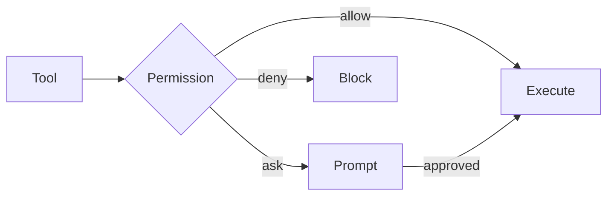

# Cyberstrike

## AI-Powered Security Assessment CLI

<!-- TODO: Logo placeholder - replace with actual logo -->
<!--  -->


**The intelligent security testing assistant**

---

# The Challenge

## Manual Security Testing Limitations

- Time-consuming reconnaissance
- Repetitive vulnerability checks
- Context switching between tools
- Inconsistent methodology coverage
- Knowledge gaps in specialized areas

---

# The Solution

## Cyberstrike: AI Meets Security

```
┌─────────────────────────────────────────┐
│                                         │
│  $ cyberstrike                          │
│                                         │
│  > Scan the target for vulnerabilities  │
│                                         │
│  [Agent: web-application]               │
│  [Model: claude-opus-4-5]               │
│                                         │
└─────────────────────────────────────────┘
```

Natural language interface to security tools

---

# Key Features

| Feature | Description |
|---------|-------------|
| **AI Agents** | Specialized for different security domains |
| **Tool Integration** | Nmap, Nuclei, SQLMap, Browser automation |
| **MCP Protocol** | Extensible tool ecosystem |
| **Memory System** | Persistent context across sessions |
| **Multi-Provider** | Claude, GPT-4, Gemini, Ollama |

---

# Architecture Overview

```
┌─────────────────────────────────────────────────────┐
│                  Cyberstrike CLI                     │
├─────────────────────────────────────────────────────┤
│  ┌─────────┐  ┌─────────┐  ┌─────────┐  ┌────────┐ │
│  │ Agents  │  │  Tools  │  │   MCP   │  │ Memory │ │
│  └────┬────┘  └────┬────┘  └────┬────┘  └───┬────┘ │
│       │            │            │            │      │
│  ┌────┴────────────┴────────────┴────────────┴────┐ │
│  │              AI Provider Layer                  │ │
│  │  (Anthropic, OpenAI, Google, Ollama, etc.)     │ │
│  └─────────────────────────────────────────────────┘ │
└─────────────────────────────────────────────────────┘
```

---

# Security Agents

## Domain-Specific Expertise

| Agent | Focus Area |
|-------|------------|
| `web-application` | OWASP Top 10, Browser testing |
| `cloud-security` | AWS, Azure, GCP auditing |
| `internal-network` | Active Directory, Network pentest |
| `bug-hunter` | Reconnaissance, Bug bounty |

---

# Web Application Agent

## OWASP WSTG Methodology

```bash
$ cyberstrike --agent web-application

> Scan https://target.com for SQL injection

[Launching browser with traffic capture...]
[Testing login form parameters...]
[Found: SQL Injection in username field]

WSTG-ID: WSTG-INPV-05
Severity: High (CVSS 8.6)
CWE: CWE-89
```

---

# Browser Automation

## Integrated Playwright with Traffic Capture

```json
{
  "action": "launch"
}
{
  "action": "navigate",
  "url": "https://target.com/login"
}
{
  "action": "fill",
  "selector": "#username",
  "value": "admin' OR '1'='1"
}
{
  "action": "network",
  "filter": { "method": "POST" }
}
{
  "action": "har"
}
```

---

# MCP Integration

## Extensible Tool Ecosystem

```json
{
  "mcp": {
    "kali": {
      "type": "local",
      "command": ["npx", "@cyberstrike/mcp-kali"]
    },
    "enterprise-scanner": {
      "type": "remote",
      "url": "https://scanner.corp.example.com/mcp",
      "oauth": true
    }
  }
}
```

---

# Memory System

## Persistent Context

```
┌─────────────────────────────────────────┐
│  Long-Term Memory (.cyberstrike/MEMORY.md)  │
├─────────────────────────────────────────┤
│  - Target uses PostgreSQL 14.2          │
│  - API authentication via JWT           │
│  - Admin panel at /admin/dashboard      │
└─────────────────────────────────────────┘

┌─────────────────────────────────────────┐
│  Daily Notes (memory/2026-02-01.md)     │
├─────────────────────────────────────────┤
│  - Found XSS in search parameter        │
│  - Credentials: test:test123            │
└─────────────────────────────────────────┘
```

---

# Provider Support

## Flexible AI Backend

| Provider | Models | Best For |
|----------|--------|----------|
| Anthropic | Claude Opus, Sonnet | Complex analysis |
| OpenAI | GPT-4o, o1 | General purpose |
| Google | Gemini 2.0 | Large context |
| Ollama | Local models | Privacy |
| OpenRouter | Many models | Cost efficiency |

---

# Permission System

## Secure by Default



Configure per-tool, per-pattern permissions

---

# Installation

## Get Started in Seconds

```bash
# npm
npm install -g @cyberstrike-io/cli

# Homebrew
brew install cyberstrike

# Bun
bun install -g @cyberstrike-io/cli
```

---

# Quick Start

## Your First Security Scan

```bash
# 1. Install
npm install -g @cyberstrike-io/cli

# 2. Authenticate
cyberstrike auth login

# 3. Start scanning
cyberstrike --agent web-application

> Enumerate subdomains for target.com
> Run nuclei scan on discovered hosts
> Check for subdomain takeover
```

---

# Configuration

## Simple JSON Config

```json
{
  "model": "anthropic/claude-opus-4-5-20250514",
  "default_agent": "web-application",
  "permission": {
    "bash": "ask",
    "edit": "allow",
    "browser": "allow"
  },
  "mcp": {
    "kali": {
      "type": "local",
      "command": ["npx", "@cyberstrike/mcp-kali"]
    }
  }
}
```

---

# Use Cases

## Security Assessment Scenarios

- **Penetration Testing**: Full-scope security assessments
- **Bug Bounty**: Automated reconnaissance and testing
- **Code Review**: Security-focused code analysis
- **Cloud Auditing**: Configuration compliance checking
- **Training**: Learn security methodologies with AI guidance

---

# Enterprise Features

## Team Collaboration

- Session sharing and export
- Enterprise authentication (SAML, OIDC)
- Audit logging
- Custom agent templates
- On-premise deployment options

---

# Resources

## Learn More

- **Documentation**: https://cyberstrike.io/docs
- **GitHub**: https://github.com/CyberStrikeus/cyberstrike.io
- **Discord**: https://discord.gg/AbESxpk6

---

# Thank You

## Start Your Security Journey

```bash
npm install -g @cyberstrike-io/cli
cyberstrike auth login
cyberstrike
```

**Questions?**

---
