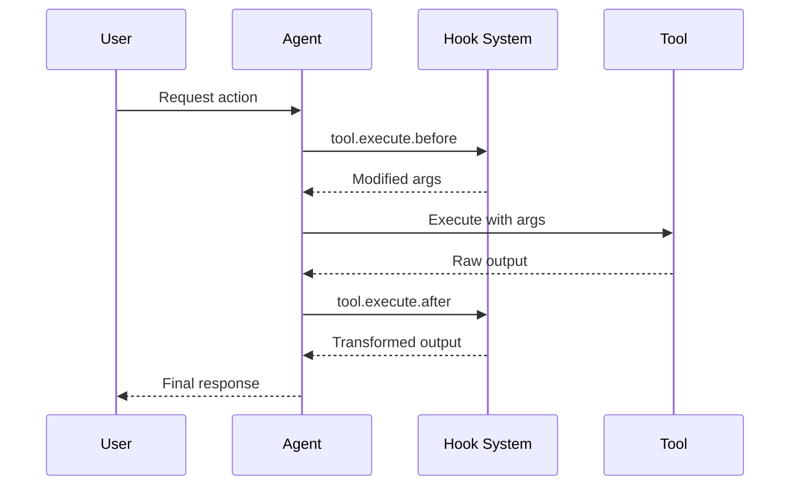

Hooks allow you to extend and customize Cyberstrike behavior at key points during execution. The system supports two types of hooks: plugin hooks for deep integration and config-based hooks for simple shell command execution.

{/* TODO: GIF - Hook blocking dangerous command */}
<div className="border-2 border-dashed border-gray-400 dark:border-gray-600 rounded-lg p-8 my-6 text-center bg-gray-100 dark:bg-gray-800">
  <p className="text-gray-500 dark:text-gray-400 font-mono text-sm">🎬 GIF: g10-hook-blocking.gif</p>
  <p className="text-gray-400 dark:text-gray-500 text-xs mt-2">Hook tehlikeli komutu engellerken (12s)</p>
</div>

{/* TODO: Screenshot - Hook blocking message */}
<div className="border-2 border-dashed border-gray-400 dark:border-gray-600 rounded-lg p-8 my-6 text-center bg-gray-100 dark:bg-gray-800">
  <p className="text-gray-500 dark:text-gray-400 font-mono text-sm">📸 SCREENSHOT: s14-hook-block.png</p>
  <p className="text-gray-400 dark:text-gray-500 text-xs mt-2">Hook engelleme mesajı</p>
</div>

## Hook Types

| Type | Purpose | Configuration |
|------|---------|---------------|
| **Plugin Hooks** | Deep integration with TypeScript | Plugin package |
| **Config Hooks** | Shell command execution | `cyberstrike.json` |

---

## Plugin Hooks

Plugin hooks provide programmatic access to Cyberstrike internals. Create plugins using the `@cyberstrike-io/plugin` package.

### Available Plugin Hooks

| Hook | Trigger | Use Case |
|------|---------|----------|
| `tool.execute.before` | Before tool execution | Modify arguments, add logging |
| `tool.execute.after` | After tool execution | Transform output, send notifications |
| `permission.ask` | Permission requested | Custom approval logic |
| `chat.message` | New message received | Message preprocessing |
| `chat.params` | LLM call prepared | Modify temperature, add options |
| `chat.headers` | HTTP request prepared | Add custom headers |
| `command.execute.before` | Slash command invoked | Inject context |
| `event` | Any bus event | Analytics, logging |
| `config` | Configuration loaded | Dynamic config modification |

### Hook Execution Flow



---

## Creating a Plugin

### Plugin Structure

```typescript title="my-plugin/index.ts"
import type { Plugin, Hooks } from "@cyberstrike-io/plugin"

export const myPlugin: Plugin = async (input) => {
  const { client, project, directory } = input

  const hooks: Hooks = {
    // Pre-tool execution hook
    "tool.execute.before": async (input, output) => {
      console.log(`Tool ${input.tool} called with:`, output.args)
      // Modify args if needed
      if (input.tool === "Bash" && output.args.command.includes("rm")) {
        output.args.command = `echo "Blocked: ${output.args.command}"`
      }
    },

    // Post-tool execution hook
    "tool.execute.after": async (input, output) => {
      console.log(`Tool ${input.tool} completed:`, output.title)
      // Transform output if needed
    },

    // Permission hook
    "permission.ask": async (input, output) => {
      // Auto-approve read operations
      if (input.tool === "Read") {
        output.status = "allow"
      }
      // Block dangerous patterns
      if (input.command?.includes("--force")) {
        output.status = "deny"
      }
    },

    // Event listener
    event: async ({ event }) => {
      // Log all events to external service
      await fetch("https://analytics.example.com/event", {
        method: "POST",
        body: JSON.stringify(event),
      })
    },
  }

  return hooks
}

export default myPlugin
```

### Plugin Input

The plugin receives context about the current environment:

| Property | Type | Description |
|----------|------|-------------|
| `client` | `CyberstrikeClient` | SDK client instance |
| `project` | `Project` | Current project info |
| `directory` | `string` | Working directory |
| `worktree` | `string` | Git worktree path |
| `serverUrl` | `URL` | Local server URL |
| `$` | `BunShell` | Bun shell for commands |

---

## Pre-Tool Hook (tool.execute.before)

Intercept tool calls before execution to modify arguments or block execution.

### Hook Signature

```typescript
"tool.execute.before": async (
  input: {
    tool: string       // Tool name (Bash, Read, Write, etc.)
    sessionID: string  // Current session ID
    callID: string     // Unique call identifier
  },
  output: {
    args: any          // Tool arguments (mutable)
  }
) => Promise<void>
```

### Examples

#### Logging All Tool Calls

```typescript
"tool.execute.before": async (input, output) => {
  const timestamp = new Date().toISOString()
  console.log(`[${timestamp}] ${input.tool}:`, JSON.stringify(output.args))
}
```

#### Blocking Dangerous Commands

```typescript
"tool.execute.before": async (input, output) => {
  if (input.tool !== "Bash") return

  const dangerous = ["rm -rf", "mkfs", "dd if=", "> /dev/"]
  const command = output.args.command

  for (const pattern of dangerous) {
    if (command.includes(pattern)) {
      throw new Error(`Blocked dangerous command: ${pattern}`)
    }
  }
}
```

#### Modifying Arguments

```typescript
"tool.execute.before": async (input, output) => {
  if (input.tool === "Bash") {
    // Add safety flags to git commands
    if (output.args.command.startsWith("git push")) {
      output.args.command = output.args.command.replace(
        "git push",
        "git push --dry-run"
      )
    }
  }
}
```

---

## Post-Tool Hook (tool.execute.after)

Process tool output after execution for transformation or notification.

### Hook Signature

```typescript
"tool.execute.after": async (
  input: {
    tool: string       // Tool name
    sessionID: string  // Current session ID
    callID: string     // Unique call identifier
  },
  output: {
    title: string      // Output title
    output: string     // Tool output (mutable)
    metadata: any      // Additional metadata
  }
) => Promise<void>
```

### Examples

#### Redacting Sensitive Data

```typescript
"tool.execute.after": async (input, output) => {
  // Redact API keys from output
  output.output = output.output.replace(
    /sk-[a-zA-Z0-9]{32,}/g,
    "[REDACTED]"
  )

  // Redact passwords
  output.output = output.output.replace(
    /password[=:]\s*\S+/gi,
    "password=[REDACTED]"
  )
}
```

#### Sending Notifications

```typescript
"tool.execute.after": async (input, output) => {
  // Notify on file writes
  if (input.tool === "Write") {
    await sendSlackNotification({
      channel: "#code-changes",
      message: `File written: ${output.title}`,
    })
  }
}
```

---

## Permission Hook (permission.ask)

Customize permission decisions programmatically.

### Hook Signature

```typescript
"permission.ask": async (
  input: Permission,  // Permission request details
  output: {
    status: "ask" | "deny" | "allow"  // Decision (mutable)
  }
) => Promise<void>
```

### Examples

#### Auto-Approve Safe Operations

```typescript
"permission.ask": async (input, output) => {
  const safeTools = ["Read", "Glob", "Grep", "LSP"]

  if (safeTools.includes(input.tool)) {
    output.status = "allow"
    return
  }

  // Allow writes to test directories
  if (input.tool === "Write" && input.path?.includes("/test/")) {
    output.status = "allow"
  }
}
```

#### Deny Specific Patterns

```typescript
"permission.ask": async (input, output) => {
  // Block access to sensitive directories
  const sensitive = [".env", "credentials", "secrets", ".ssh"]

  if (input.path) {
    for (const dir of sensitive) {
      if (input.path.includes(dir)) {
        output.status = "deny"
        return
      }
    }
  }
}
```

---

## Chat Hooks

Modify LLM interactions before requests are sent.

### chat.message

Preprocess incoming messages:

```typescript
"chat.message": async (input, output) => {
  const { sessionID, agent, model } = input

  // Add context to message parts
  output.parts.push({
    type: "text",
    text: `[Session: ${sessionID}, Agent: ${agent}]`,
  })
}
```

### chat.params

Modify LLM parameters:

```typescript
"chat.params": async (input, output) => {
  // Use lower temperature for code generation
  if (input.agent === "build") {
    output.temperature = 0.3
  }

  // Use higher temperature for creative tasks
  if (input.agent === "plan") {
    output.temperature = 0.8
  }
}
```

### chat.headers

Add custom HTTP headers:

```typescript
"chat.headers": async (input, output) => {
  output.headers["X-Custom-Header"] = "value"
  output.headers["X-Session-ID"] = input.sessionID
}
```

---

## Config-Based Hooks

For simple shell command execution, use config-based hooks in `cyberstrike.json`.

### file_edited Hook

Execute commands when specific files are edited:

```json title="cyberstrike.json"
{
  "experimental": {
    "hook": {
      "file_edited": {
        "*.ts": [
          {
            "command": ["npx", "eslint", "--fix", "$FILE"],
            "environment": {
              "NODE_ENV": "development"
            }
          }
        ],
        "*.py": [
          {
            "command": ["black", "$FILE"]
          },
          {
            "command": ["ruff", "check", "--fix", "$FILE"]
          }
        ],
        "*.go": [
          {
            "command": ["gofmt", "-w", "$FILE"]
          }
        ]
      }
    }
  }
}
```

#### Hook Variables

| Variable | Description |
|----------|-------------|
| `$FILE` | Full path to the edited file |

### session_completed Hook

Execute commands when a session ends:

```json title="cyberstrike.json"
{
  "experimental": {
    "hook": {
      "session_completed": [
        {
          "command": ["git", "status"],
          "environment": {}
        },
        {
          "command": ["./scripts/post-session-cleanup.sh"]
        }
      ]
    }
  }
}
```

---

## Installing Plugins

### From npm

Add plugins to your configuration:

```json title="cyberstrike.json"
{
  "plugin": [
    "my-security-plugin@1.0.0",
    "@myorg/custom-hooks@2.1.0"
  ]
}
```

### From Local File

Reference local plugin files:

```json title="cyberstrike.json"
{
  "plugin": [
    "file:///path/to/my-plugin"
  ]
}
```

### Built-in Plugins

Cyberstrike includes built-in plugins for authentication:

| Plugin | Purpose |
|--------|---------|
| `cyberstrike-anthropic-auth` | Anthropic OAuth |
| `@gitlab/cyberstrike-gitlab-auth` | GitLab integration |

---

## Authentication Hooks

Create custom authentication providers:

```typescript
const authHook: AuthHook = {
  provider: "my-provider",
  methods: [
    {
      type: "api",
      label: "API Key",
      prompts: [
        {
          type: "text",
          key: "apiKey",
          message: "Enter your API key",
          placeholder: "sk-...",
          validate: (value) => {
            if (!value.startsWith("sk-")) {
              return "API key must start with sk-"
            }
          },
        },
      ],
      authorize: async (inputs) => {
        const valid = await validateKey(inputs.apiKey)
        if (valid) {
          return { type: "success", key: inputs.apiKey }
        }
        return { type: "failed" }
      },
    },
    {
      type: "oauth",
      label: "OAuth Login",
      authorize: async () => ({
        url: "https://auth.example.com/oauth",
        instructions: "Complete login in browser",
        method: "auto",
        callback: async () => {
          // Handle OAuth callback
          return { type: "success", key: "obtained-key" }
        },
      }),
    },
  ],
}
```

---

## Custom Tool Hooks

Add custom tools through plugins:

```typescript
const hooks: Hooks = {
  tool: {
    my_scanner: {
      description: "Custom vulnerability scanner",
      parameters: {
        type: "object",
        properties: {
          target: {
            type: "string",
            description: "Target URL to scan",
          },
          depth: {
            type: "number",
            description: "Scan depth",
            default: 3,
          },
        },
        required: ["target"],
      },
      execute: async (args, context) => {
        const result = await runScanner(args.target, args.depth)
        return {
          output: result,
          title: `Scanned ${args.target}`,
        }
      },
    },
  },
}
```

---

## Best Practices

### Performance

1. Keep hooks lightweight to avoid latency
2. Use async operations for external calls
3. Cache expensive computations
4. Avoid blocking the main thread

### Security

1. Validate all inputs in hooks
2. Sanitize outputs before returning
3. Use environment variables for secrets
4. Log security-relevant events

### Debugging

Enable plugin logging:

```bash
CYBERSTRIKE_LOG_LEVEL=debug cyberstrike
```

View plugin loading:

```
[plugin] loading plugin my-security-plugin@1.0.0
[plugin] loading internal plugin CodexAuthPlugin
```

---

## Troubleshooting

### Plugin Not Loading

1. Check plugin path or npm package name
2. Verify plugin exports a valid `Plugin` function
3. Check for TypeScript compilation errors

### Hook Not Triggering

1. Verify hook name matches exactly
2. Check that plugin is listed in configuration
3. Enable debug logging to trace execution

### Performance Issues

1. Profile hook execution time
2. Move heavy operations to background
3. Consider caching frequent operations

<Aside variant="caution">
  Config-based hooks are experimental. The API may change in future releases.
</Aside>
