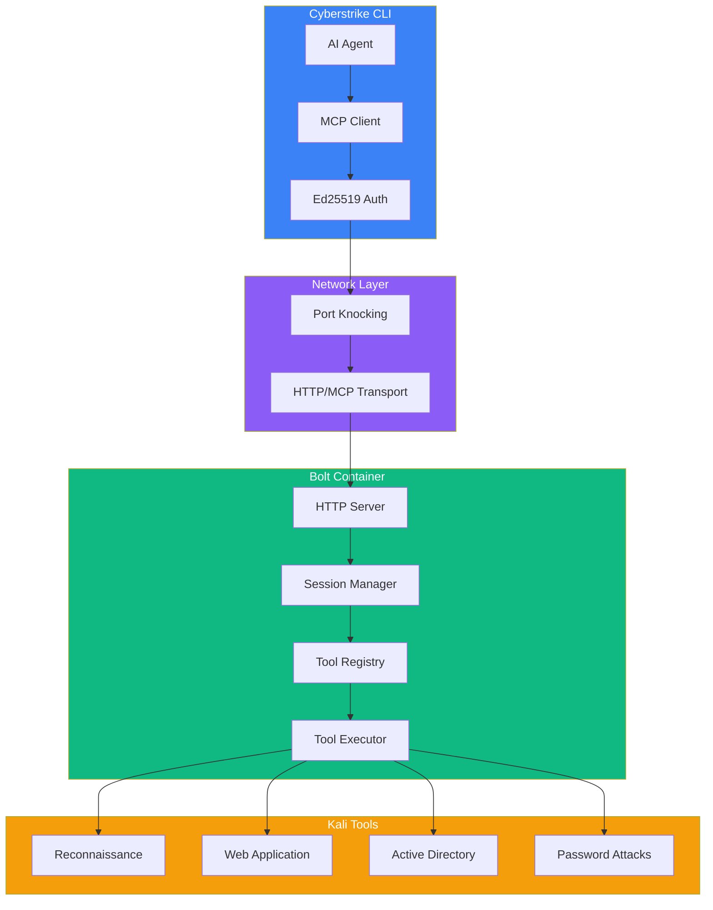
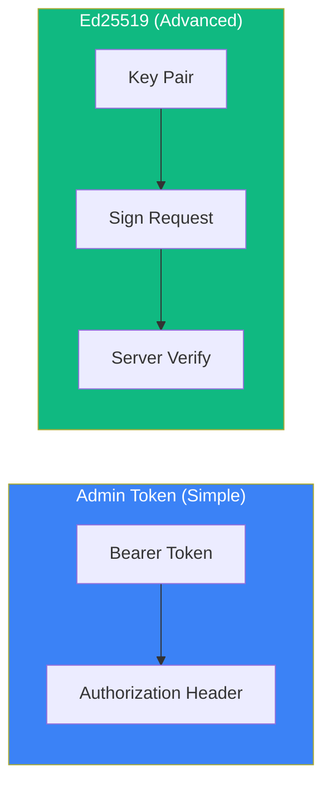
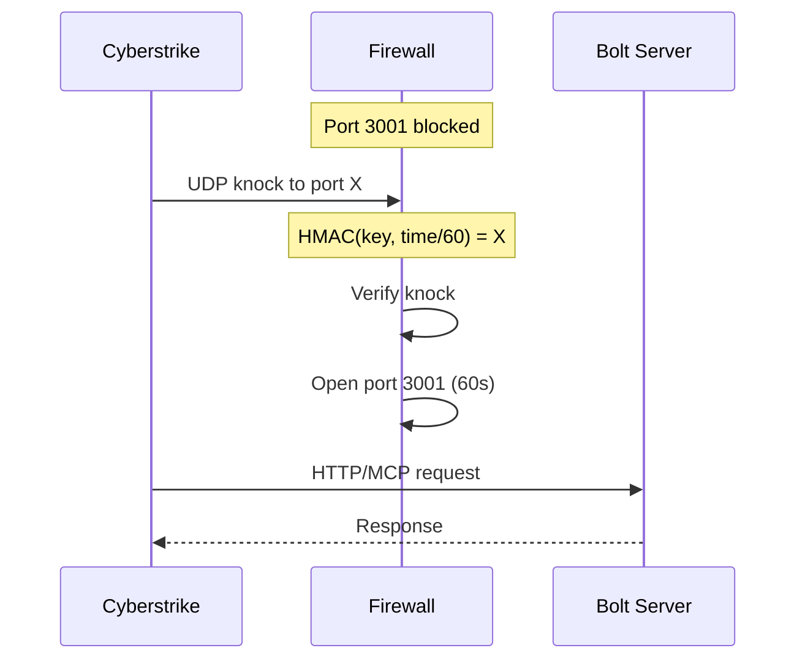

Bolt provides access to 100+ Kali Linux security tools through a remote MCP server running in a Docker container. It features Ed25519 authentication and optional port knocking for secure remote access.

{/* Hero Screenshot - Bolt in action */}
<div className="border-2 border-dashed border-gray-400 dark:border-gray-600 rounded-lg p-8 my-6 text-center bg-gray-100 dark:bg-gray-800">
  <p className="text-gray-500 dark:text-gray-400 font-mono text-sm">📸 SCREENSHOT: bolt-hero.png</p>
  <p className="text-gray-400 dark:text-gray-500 text-xs mt-2">Bolt running nmap scan through Cyberstrike</p>
</div>

## Why Bolt?

Bolt solves the problem of running security tools that require a Linux environment. Instead of installing dozens of tools locally, Bolt runs them in an isolated Docker container.

{/* MARP Slide - Why Bolt */}
<div className="border-2 border-dashed border-gray-400 dark:border-gray-600 rounded-lg p-8 my-6 text-center bg-gray-100 dark:bg-gray-800">
  <p className="text-gray-500 dark:text-gray-400 font-mono text-sm">🎞️ MARP SLIDE: why-bolt.md</p>
  <p className="text-gray-400 dark:text-gray-500 text-xs mt-2">Benefits of using Bolt vs local installation</p>
</div>

| Feature | Without Bolt | With Bolt |
|---------|--------------|-----------|
| Tool Installation | Manual for each tool | Pre-installed |
| Platform Support | Linux only for most tools | Any platform with Docker |
| Isolation | Tools run on your system | Sandboxed in container |
| Setup Time | Hours | Minutes |
| Updates | Manual | `docker pull` |

---

## Architecture

{/* MARP Slide - Bolt Architecture Deep Dive */}
<div className="border-2 border-dashed border-gray-400 dark:border-gray-600 rounded-lg p-8 my-6 text-center bg-gray-100 dark:bg-gray-800">
  <p className="text-gray-500 dark:text-gray-400 font-mono text-sm">🎞️ MARP SLIDE: bolt-architecture.md</p>
  <p className="text-gray-400 dark:text-gray-500 text-xs mt-2">Detailed Bolt architecture presentation</p>
</div>



### Component Details

| Component | Description |
|-----------|-------------|
| **MCP Client** | Handles JSON-RPC communication with Bolt |
| **Ed25519 Auth** | Asymmetric key authentication for secure access |
| **Port Knocking** | Optional SPA to hide server from port scans |
| **Session Manager** | Per-client registry isolation |
| **Tool Registry** | Dynamic tool loading system |
| **Tool Executor** | Spawns Kali tool processes |

---

## Quick Start

{/* GIF - Quick Start Demo */}
<div className="border-2 border-dashed border-gray-400 dark:border-gray-600 rounded-lg p-8 my-6 text-center bg-gray-100 dark:bg-gray-800">
  <p className="text-gray-500 dark:text-gray-400 font-mono text-sm">🎬 GIF: bolt-quickstart.gif</p>
  <p className="text-gray-400 dark:text-gray-500 text-xs mt-2">Complete Bolt setup in 60 seconds</p>
</div>

### 1. Start Bolt Server

```bash
# One-liner install (pulls from ghcr.io)
curl -sSL https://bolt.cyberstrike.io/install.sh | bash
```

Or manually with Docker:

```bash
docker run -d \
  --name bolt \
  -p 3001:3001 \
  -e MCP_ADMIN_TOKEN=$(openssl rand -hex 32) \
  ghcr.io/cyberstrikeus/bolt:latest
```

### 2. Get the Admin Token

```bash
docker logs bolt | grep "Admin token"
```

{/* Screenshot - Docker logs output */}
<div className="border-2 border-dashed border-gray-400 dark:border-gray-600 rounded-lg p-8 my-6 text-center bg-gray-100 dark:bg-gray-800">
  <p className="text-gray-500 dark:text-gray-400 font-mono text-sm">📸 SCREENSHOT: bolt-docker-logs.png</p>
  <p className="text-gray-400 dark:text-gray-500 text-xs mt-2">Docker logs showing admin token</p>
</div>

### 3. Add to Cyberstrike

Use the `/bolt` command in the TUI:

1. Press `/` and type `bolt`
2. Press **a** to add a new server
3. Enter URL: `http://localhost:3001`
4. Enter the admin token
5. Give it a name (e.g., "local")

{/* GIF - /bolt dialog flow */}
<div className="border-2 border-dashed border-gray-400 dark:border-gray-600 rounded-lg p-8 my-6 text-center bg-gray-100 dark:bg-gray-800">
  <p className="text-gray-500 dark:text-gray-400 font-mono text-sm">🎬 GIF: bolt-add-dialog.gif</p>
  <p className="text-gray-400 dark:text-gray-500 text-xs mt-2">Adding Bolt server via /bolt dialog (20s)</p>
</div>

Or add manually to config:

```json title="~/.config/cyberstrike/cyberstrike.json"
{
  "mcp": {
    "bolt": {
      "type": "remote",
      "url": "http://localhost:3001/mcp",
      "bolt": true,
      "headers": {
        "Authorization": "Bearer YOUR_ADMIN_TOKEN"
      }
    }
  }
}
```

### 4. Use Bolt Tools

```
> Search for reconnaissance tools on bolt
> Load nmap and scan 192.168.1.1
```

{/* GIF - Using Bolt tools */}
<div className="border-2 border-dashed border-gray-400 dark:border-gray-600 rounded-lg p-8 my-6 text-center bg-gray-100 dark:bg-gray-800">
  <p className="text-gray-500 dark:text-gray-400 font-mono text-sm">🎬 GIF: bolt-nmap-scan.gif</p>
  <p className="text-gray-400 dark:text-gray-500 text-xs mt-2">Running nmap scan via Bolt (30s)</p>
</div>

---

## Installation Methods

### Docker (Recommended)

{/* MARP Slide - Docker Installation */}
<div className="border-2 border-dashed border-gray-400 dark:border-gray-600 rounded-lg p-8 my-6 text-center bg-gray-100 dark:bg-gray-800">
  <p className="text-gray-500 dark:text-gray-400 font-mono text-sm">🎞️ MARP SLIDE: docker-installation.md</p>
  <p className="text-gray-400 dark:text-gray-500 text-xs mt-2">Docker installation options</p>
</div>

The official Docker image includes all Kali tools pre-installed:

```bash
# Using docker run
docker run -d \
  --name bolt \
  --restart unless-stopped \
  -p 3001:3001 \
  -v bolt-data:/data \
  -e MCP_ADMIN_TOKEN=$(openssl rand -hex 32) \
  --cap-add NET_RAW \
  --cap-add NET_ADMIN \
  ghcr.io/cyberstrikeus/bolt:latest

# View the admin token
docker logs bolt
```

### Docker Compose

```yaml title="docker-compose.yml"
services:
  bolt:
    image: ghcr.io/cyberstrikeus/bolt:latest
    ports:
      - "3001:3001"
    environment:
      - MCP_ADMIN_TOKEN=${MCP_ADMIN_TOKEN}
    cap_add:
      - NET_RAW
      - NET_ADMIN
    volumes:
      - bolt-data:/data
    restart: unless-stopped

volumes:
  bolt-data:
```

```bash
export MCP_ADMIN_TOKEN=$(openssl rand -hex 32)
docker compose up -d
```

### Local Installation (Without Docker)

If you have Kali tools installed locally:

```json title="cyberstrike.json"
{
  "mcp": {
    "bolt-local": {
      "type": "local",
      "command": ["npx", "@cyberstrike/mcp-kali"]
    }
  }
}
```

<Aside variant="info">
  Local installation requires each Kali tool to be installed separately on your machine.
</Aside>

---

## TUI Management

The `/bolt` command is the unified interface for managing **all MCP servers** - both the Bolt Kali container and your custom local/remote MCP servers.

{/* GIF - TUI Management */}
<div className="border-2 border-dashed border-gray-400 dark:border-gray-600 rounded-lg p-8 my-6 text-center bg-gray-100 dark:bg-gray-800">
  <p className="text-gray-500 dark:text-gray-400 font-mono text-sm">🎬 GIF: bolt-tui-full-demo.gif</p>
  <p className="text-gray-400 dark:text-gray-500 text-xs mt-2">Complete TUI management demo (40s)</p>
</div>

### The /bolt Command

Access MCP server management with `/bolt` in the TUI:

| Key | Action |
|-----|--------|
| **a** | Add new MCP server (local or remote) |
| **space** | Toggle connection |
| **d** | Delete server |
| **esc** | Close dialog |

### Server Type Indicators

| Icon | Type |
|------|------|
| ⚡ | Bolt container (Kali tools) |
| ◆ | Local MCP server (stdio) |
| ◇ | Remote MCP server (HTTP) |

### Connection States

| Color | Status |
|-------|--------|
| Green | Connected and ready |
| Gray | Disabled |
| Red | Failed |
| Yellow | Needs authentication |

{/* Screenshot - All status states */}
<div className="border-2 border-dashed border-gray-400 dark:border-gray-600 rounded-lg p-8 my-6 text-center bg-gray-100 dark:bg-gray-800">
  <p className="text-gray-500 dark:text-gray-400 font-mono text-sm">📸 SCREENSHOT: bolt-status-states.png</p>
  <p className="text-gray-400 dark:text-gray-500 text-xs mt-2">All possible Bolt status states</p>
</div>

---

## Available Tools

{/* MARP Slide - Tool Categories */}
<div className="border-2 border-dashed border-gray-400 dark:border-gray-600 rounded-lg p-8 my-6 text-center bg-gray-100 dark:bg-gray-800">
  <p className="text-gray-500 dark:text-gray-400 font-mono text-sm">🎞️ MARP SLIDE: tool-categories.md</p>
  <p className="text-gray-400 dark:text-gray-500 text-xs mt-2">Visual overview of 100+ tools by category</p>
</div>

Bolt provides 100+ tools organized by category:

### Reconnaissance

| Tool | Description |
|------|-------------|
| nmap | Network scanner and service detection |
| masscan | Fast port scanner |
| subfinder | Passive subdomain discovery |
| amass | Attack surface mapping |
| httpx | HTTP probing |
| whatweb | Web technology identification |
| wafw00f | WAF detection |

### Web Application

| Tool | Description |
|------|-------------|
| sqlmap | SQL injection automation |
| ffuf | Web fuzzer |
| gobuster | Directory/DNS enumeration |
| wfuzz | Web application fuzzer |
| nuclei | Template-based scanner |
| nikto | Web server scanner |
| wpscan | WordPress scanner |

### Active Directory

| Tool | Description |
|------|-------------|
| netexec | Network execution tool |
| impacket-scripts | Windows protocol tools |
| enum4linux-ng | SMB enumeration |
| bloodhound | AD relationship mapping |
| certipy-ad | AD CS exploitation |
| responder | LLMNR/NBT-NS poisoning |

### Password Attacks

| Tool | Description |
|------|-------------|
| john | Password cracker |
| hashcat | GPU password cracker |
| hydra | Online password attacks |
| medusa | Parallel password cracker |

### Exploitation

| Tool | Description |
|------|-------------|
| metasploit-framework | Exploitation framework |
| exploitdb | Exploit database search |
| msfvenom | Payload generator |

---

## Meta-Tools

{/* MARP Slide - Meta-Tools Explained */}
<div className="border-2 border-dashed border-gray-400 dark:border-gray-600 rounded-lg p-8 my-6 text-center bg-gray-100 dark:bg-gray-800">
  <p className="text-gray-500 dark:text-gray-400 font-mono text-sm">🎞️ MARP SLIDE: meta-tools.md</p>
  <p className="text-gray-400 dark:text-gray-500 text-xs mt-2">How meta-tools manage dynamic loading</p>
</div>

Bolt uses a dynamic tool loading system. These meta-tools manage which Kali tools are available:

### list_tools

List all available tools or filter by category:

```json
{
  "category": "reconnaissance",
  "limit": 20
}
```

### search_tools

Search tools by name or description:

```json
{
  "query": "sql injection",
  "limit": 10
}
```

### load_tool

Load a tool into the current session:

```json
{
  "tool": "nmap"
}
```

### execute

Execute a loaded tool:

```json
{
  "tool": "nmap",
  "args": ["-sV", "-sC", "192.168.1.1"]
}
```

### list_loaded_tools

Show currently loaded tools and token usage:

```json
{
  "loaded": ["nmap", "nikto"],
  "estimatedTokens": 2500,
  "budgetRemaining": 17500
}
```

### unload_tool

Free up token budget by unloading tools:

```json
{
  "tool": "nmap"
}
```

---

## Usage Examples

{/* GIF - Usage Examples */}
<div className="border-2 border-dashed border-gray-400 dark:border-gray-600 rounded-lg p-8 my-6 text-center bg-gray-100 dark:bg-gray-800">
  <p className="text-gray-500 dark:text-gray-400 font-mono text-sm">🎬 GIF: bolt-usage-examples.gif</p>
  <p className="text-gray-400 dark:text-gray-500 text-xs mt-2">Multiple tool usage scenarios (45s)</p>
</div>

### Network Reconnaissance

```
> Use bolt to scan 192.168.1.0/24 for open ports and services
```

The agent will:
1. Load nmap via `bolt_load_tool`
2. Execute scan via `bolt_execute`
3. Parse and present results

### Subdomain Enumeration

```
> Find all subdomains of example.com using bolt
```

Uses subfinder, amass, or similar tools.

### SQL Injection Testing

```
> Test https://target.com/page?id=1 for SQL injection via bolt
```

Loads sqlmap and runs automated testing.

### Active Directory Assessment

```
> Enumerate the AD environment at 192.168.1.10 using bolt
```

Uses netexec, enum4linux-ng, and related tools.

---

## Security Features

{/* MARP Slide - Security Architecture */}
<div className="border-2 border-dashed border-gray-400 dark:border-gray-600 rounded-lg p-8 my-6 text-center bg-gray-100 dark:bg-gray-800">
  <p className="text-gray-500 dark:text-gray-400 font-mono text-sm">🎞️ MARP SLIDE: security-architecture.md</p>
  <p className="text-gray-400 dark:text-gray-500 text-xs mt-2">Bolt security features deep dive</p>
</div>

### Authentication Methods



#### Admin Token (Simple)

Use a bearer token for authentication:

```json
{
  "headers": {
    "Authorization": "Bearer YOUR_ADMIN_TOKEN"
  }
}
```

#### Ed25519 Keys (Advanced)

For production deployments, use asymmetric key authentication:

1. Generate client keys
2. Pair with the server via `/pair` endpoint
3. Sign requests with your private key

### Port Knocking (SPA)

{/* MARP Slide - Port Knocking */}
<div className="border-2 border-dashed border-gray-400 dark:border-gray-600 rounded-lg p-8 my-6 text-center bg-gray-100 dark:bg-gray-800">
  <p className="text-gray-500 dark:text-gray-400 font-mono text-sm">🎞️ MARP SLIDE: port-knocking.md</p>
  <p className="text-gray-400 dark:text-gray-500 text-xs mt-2">How port knocking hides the server</p>
</div>

Enable port knocking to hide the server from port scans:

```bash
docker run -d \
  --name bolt \
  -p 3001:3001 \
  -p 49152-65535:49152-65535/udp \
  -e KNOCK_ENABLED=true \
  ghcr.io/cyberstrikeus/bolt:latest node dist/http.js --knock
```

**How it works:**



With knock enabled:
- Port 3001 is blocked by iptables
- Clients must send a UDP knock packet first
- Knock ports rotate every 60 seconds
- Port is derived from: `HMAC-SHA256(boltKey, timestamp/60)`

<Aside variant="tip">
  Port knocking is ideal for internet-exposed Bolt servers. For local Docker, it's optional.
</Aside>

---

## Configuration

### Environment Variables

| Variable | Default | Description |
|----------|---------|-------------|
| `PORT` | 3001 | HTTP server port |
| `HOST` | 0.0.0.0 | Bind address |
| `MCP_ADMIN_TOKEN` | - | Admin bearer token |
| `DATA_DIR` | /data | Persistent data directory |
| `KNOCK_ENABLED` | false | Enable port knocking |

### Docker Capabilities

For full functionality, Bolt needs:

| Capability | Purpose |
|------------|---------|
| `NET_RAW` | Raw socket access for nmap SYN scans |
| `NET_ADMIN` | Network configuration for iptables |

### Volumes

| Path | Purpose |
|------|---------|
| `/data` | Persistent keys, scan results |

---

## Comparison: Local vs Remote

{/* MARP Slide - Comparison */}
<div className="border-2 border-dashed border-gray-400 dark:border-gray-600 rounded-lg p-8 my-6 text-center bg-gray-100 dark:bg-gray-800">
  <p className="text-gray-500 dark:text-gray-400 font-mono text-sm">🎞️ MARP SLIDE: local-vs-remote.md</p>
  <p className="text-gray-400 dark:text-gray-500 text-xs mt-2">Detailed comparison table with use cases</p>
</div>

| Feature | Local | Remote (Docker) |
|---------|-------|-----------------|
| Tool Installation | Manual | Pre-installed |
| Isolation | None | Container |
| Performance | Faster | Network overhead |
| Setup | Complex | One command |
| Updates | Manual | `docker pull` |
| Cross-platform | No | Yes |

---

## Troubleshooting

{/* Screenshot - Common errors */}
<div className="border-2 border-dashed border-gray-400 dark:border-gray-600 rounded-lg p-8 my-6 text-center bg-gray-100 dark:bg-gray-800">
  <p className="text-gray-500 dark:text-gray-400 font-mono text-sm">📸 SCREENSHOT: bolt-errors.png</p>
  <p className="text-gray-400 dark:text-gray-500 text-xs mt-2">Common Bolt errors and their appearance</p>
</div>

### Connection Refused

```
Error: Connection refused
```

1. Check Docker is running: `docker ps`
2. Verify port mapping: `docker port bolt`
3. Test health endpoint: `curl http://localhost:3001/health`

### Tools Not Loading

```
> Agent says "tool not found"
```

1. Verify MCP is connected: `/bolt` in TUI
2. Check model supports MCP (not subprocess models like claude-cli)
3. Restart Cyberstrike after adding Bolt

### Subprocess Models

<Aside variant="caution">
  Models running as subprocesses (like `claude-cli/opus`) cannot access Cyberstrike's MCP servers.
</Aside>

Use direct API models:

- `anthropic/claude-sonnet-4`
- `anthropic/claude-opus-4`
- `openai/gpt-4o`

### Port Knocking Issues

If knock is enabled but connection fails:

1. Ensure UDP ports are forwarded: `-p 49152-65535:49152-65535/udp`
2. Check bolt key is correct
3. Verify system clocks are synchronized

---

## API Reference

### Health Check

```bash
curl http://localhost:3001/health
```

Response:
```json
{
  "status": "ok",
  "version": "1.0.0",
  "tools": 100,
  "sessions": 2
}
```

### MCP Endpoint

```
POST /mcp
```

Standard MCP JSON-RPC endpoint for tool calls.

### Pairing (Ed25519)

```
POST /pair          # Start pairing with code
POST /pair/exchange # Exchange public keys
GET  /pair/clients  # List paired clients (admin only)
```

---

## Related Documentation

- [Bolt / MCP Overview](/docs/mcp) - Architecture and concepts
- [Remote Servers](/docs/mcp/remote-servers) - Remote MCP configuration
- [Local Servers](/docs/mcp/local-servers) - Alternative local setup
- [Permissions](/docs/permissions) - Tool permissions

<Aside variant="danger">
  Only use Bolt tools against authorized targets. Unauthorized penetration testing is illegal.
</Aside>
