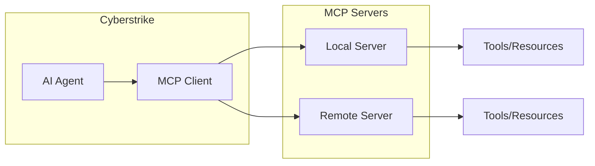

Model Context Protocol (MCP) enables Cyberstrike to integrate with external tools and services. This guide covers configuring, using, and creating MCP servers.

{/* TODO: GIF - MCP tool discovery */}
<div className="border-2 border-dashed border-gray-400 dark:border-gray-600 rounded-lg p-8 my-6 text-center bg-gray-100 dark:bg-gray-800">
  <p className="text-gray-500 dark:text-gray-400 font-mono text-sm">🎬 GIF: g07-mcp-discovery.gif</p>
  <p className="text-gray-400 dark:text-gray-500 text-xs mt-2">MCP araç keşfi demosu (15s)</p>
</div>

{/* TODO: Screenshot - MCP tool list */}
<div className="border-2 border-dashed border-gray-400 dark:border-gray-600 rounded-lg p-8 my-6 text-center bg-gray-100 dark:bg-gray-800">
  <p className="text-gray-500 dark:text-gray-400 font-mono text-sm">📸 SCREENSHOT: s10-mcp-tools.png</p>
  <p className="text-gray-400 dark:text-gray-500 text-xs mt-2">MCP araç listesi görünümü</p>
</div>

## Understanding MCP

MCP is a standardized protocol that allows AI agents to interact with external tools, resources, and services. It provides:

- **Tools**: Executable functions the AI can call
- **Resources**: Data sources the AI can read
- **Prompts**: Reusable prompt templates



---

## Server Types

### Local Servers

Local MCP servers run as child processes on your machine. They are ideal for:

- Security tools requiring local execution
- File system access
- Local database connections
- Custom tooling

### Remote Servers

Remote MCP servers connect over HTTP/HTTPS. They are ideal for:

- Cloud-hosted services
- Team-shared tools
- Services requiring authentication
- Enterprise integrations

---

## Configuration

### Adding a Local Server

Configure local servers in `cyberstrike.json`:

```json title="cyberstrike.json"
{
  "mcp": {
    "filesystem": {
      "type": "local",
      "command": ["npx", "@modelcontextprotocol/server-filesystem", "/path/to/dir"],
      "enabled": true,
      "timeout": 30000
    }
  }
}
```

#### Local Server Options

| Option | Type | Description |
|--------|------|-------------|
| `type` | `"local"` | Server type |
| `command` | `string[]` | Command and arguments |
| `environment` | `object` | Environment variables |
| `enabled` | `boolean` | Enable/disable server |
| `timeout` | `number` | Request timeout in ms |

### Adding a Remote Server

Configure remote servers for HTTP/HTTPS endpoints:

```json title="cyberstrike.json"
{
  "mcp": {
    "security-api": {
      "type": "remote",
      "url": "https://api.security-tools.example.com/mcp",
      "headers": {
        "X-API-Key": "{env:SECURITY_API_KEY}"
      },
      "enabled": true,
      "timeout": 60000
    }
  }
}
```

#### Remote Server Options

| Option | Type | Description |
|--------|------|-------------|
| `type` | `"remote"` | Server type |
| `url` | `string` | Server URL |
| `headers` | `object` | Custom HTTP headers |
| `oauth` | `object/false` | OAuth configuration |
| `enabled` | `boolean` | Enable/disable server |
| `timeout` | `number` | Request timeout in ms |

---

## Interactive Setup

Use the CLI to add MCP servers interactively:

```bash
cyberstrike mcp add
```

The wizard prompts for:

1. **Location**: Project or global configuration
2. **Name**: Server identifier
3. **Type**: Local or remote
4. **Connection details**: Command or URL

---

## OAuth Authentication

Remote MCP servers can require OAuth authentication.

### Automatic OAuth

OAuth is enabled by default for remote servers. Cyberstrike handles:

1. Authorization code flow
2. Token refresh
3. Secure storage

### Manual OAuth Configuration

Specify OAuth settings when required:

```json
{
  "mcp": {
    "enterprise-tools": {
      "type": "remote",
      "url": "https://tools.enterprise.com/mcp",
      "oauth": {
        "clientId": "your-client-id",
        "clientSecret": "{env:OAUTH_CLIENT_SECRET}",
        "scope": "tools:read tools:execute"
      }
    }
  }
}
```

### Authentication Commands

```bash
# Authenticate with an OAuth server
cyberstrike mcp auth [server-name]

# List OAuth status for all servers
cyberstrike mcp auth list

# Remove OAuth credentials
cyberstrike mcp logout [server-name]

# Debug OAuth issues
cyberstrike mcp debug <server-name>
```

### OAuth Status Icons

| Icon | Status |
|------|--------|
| `✓` | Authenticated |
| `⚠` | Expired (needs refresh) |
| `✗` | Not authenticated |

---

## Managing Servers

### List Servers

View configured servers and their status:

```bash
cyberstrike mcp list
```

Output:

```
MCP Servers

✓ filesystem       connected
    npx @modelcontextprotocol/server-filesystem /home/user/projects

✓ security-api     connected (OAuth)
    https://api.security-tools.example.com/mcp

○ disabled-server  disabled
    npx some-server

✗ failing-server   failed
    Connection refused

3 server(s)
```

### Status Icons

| Icon | Status |
|------|--------|
| `✓` | Connected |
| `○` | Disabled or not initialized |
| `⚠` | Needs authentication |
| `✗` | Failed |

### Toggle Servers

Use the TUI to enable/disable servers:

```
/mcps
```

Or modify `enabled` in the configuration file.

---

## Using MCP Tools

### Tool Discovery

MCP tools appear in the tool search system:

```
> /tool:kali_nmap
```

Or use the `tool_search` built-in tool:

```json
{
  "query": "port scanner",
  "limit": 5
}
```

### Loading Tools

Load discovered tools into the session:

```json
{
  "tool_ids": ["kali_nmap", "kali_nikto"]
}
```

### Tool Naming Convention

MCP tools are prefixed with the server name:

| Server | Tool | Full Name |
|--------|------|-----------|
| `kali` | `nmap` | `kali_nmap` |
| `security` | `scan` | `security_scan` |

---

## MCP Resources

Resources provide data context to the AI agent.

### Accessing Resources

Use `@` mentions to reference MCP resources:

```
@security-api://reports/latest analyze this vulnerability report
```

### Listing Resources

Resources appear in the autocomplete when typing `@`.

---

## Built-in MCP Servers

### mcp-kali

Kali Linux security tools integration:

```json
{
  "mcp": {
    "kali": {
      "type": "local",
      "command": ["npx", "@cyberstrike/mcp-kali"]
    }
  }
}
```

**Available Tools:**

| Tool | Description |
|------|-------------|
| `nmap` | Network scanning |
| `nikto` | Web server scanning |
| `sqlmap` | SQL injection testing |
| `gobuster` | Directory enumeration |
| `ffuf` | Web fuzzing |
| `nuclei` | Vulnerability scanning |
| `hydra` | Password cracking |
| `wpscan` | WordPress scanning |

---

## Creating Custom MCP Servers

### Server Structure

Create an MCP server using the SDK:

```typescript title="my-server/index.ts"
import { Server } from "@modelcontextprotocol/sdk/server/index.js";
import { StdioServerTransport } from "@modelcontextprotocol/sdk/server/stdio.js";

const server = new Server({
  name: "my-security-tools",
  version: "1.0.0",
}, {
  capabilities: {
    tools: {},
    resources: {},
  },
});

// Define tools
server.setRequestHandler("tools/list", async () => ({
  tools: [
    {
      name: "scan_target",
      description: "Scan a target for vulnerabilities",
      inputSchema: {
        type: "object",
        properties: {
          target: { type: "string", description: "Target URL or IP" },
          depth: { type: "number", description: "Scan depth" },
        },
        required: ["target"],
      },
    },
  ],
}));

// Handle tool calls
server.setRequestHandler("tools/call", async (request) => {
  if (request.params.name === "scan_target") {
    const { target, depth } = request.params.arguments;
    // Implement scanning logic
    return {
      content: [{ type: "text", text: `Scanned ${target}` }],
    };
  }
});

// Start server
const transport = new StdioServerTransport();
await server.connect(transport);
```

### Publishing

Publish your server to npm:

```bash
npm publish
```

Users can then configure it:

```json
{
  "mcp": {
    "my-tools": {
      "type": "local",
      "command": ["npx", "my-security-tools"]
    }
  }
}
```

---

## Dynamic Tool Loading

Cyberstrike uses dynamic tool loading to manage hundreds of MCP tools without overwhelming the context window.

### How It Works

1. **Tool Search**: Agent searches for needed capabilities
2. **Load Tools**: Selected tools are loaded into context
3. **Use Tools**: Loaded tools become available
4. **Unload Tools**: Free context budget when done

### Token Budget

Each loaded tool consumes context tokens. Monitor usage with:

```json
// list_loaded_tools output
{
  "available": 150,
  "loaded": 12,
  "estimatedTokens": 4500,
  "budgetRemaining": 15500
}
```

### Best Practices

1. Load only needed tools
2. Unload tools after use
3. Use specific search queries
4. Monitor token budget

---

## Configuration Locations

MCP servers can be configured at multiple levels:

| Location | Scope | Priority |
|----------|-------|----------|
| `./cyberstrike.json` | Project | Highest |
| `./.cyberstrike/cyberstrike.json` | Project | High |
| `~/.cyberstrike/config.json` | Global | Low |

Project configuration overrides global configuration.

---

## Troubleshooting

### Server Not Connecting

1. Check server status:
   ```bash
   cyberstrike mcp list
   ```

2. Verify command exists:
   ```bash
   npx @modelcontextprotocol/server-filesystem --help
   ```

3. Check timeout settings

### OAuth Issues

1. Debug OAuth flow:
   ```bash
   cyberstrike mcp debug server-name
   ```

2. Re-authenticate:
   ```bash
   cyberstrike mcp auth server-name
   ```

3. Check stored credentials:
   ```bash
   cyberstrike mcp auth list
   ```

### Tool Not Found

1. Verify server is connected
2. Check tool naming: `servername_toolname`
3. Search for the tool:
   ```json
   { "query": "tool description" }
   ```

---

## Security Considerations

### Local Servers

- Run with minimum required permissions
- Validate tool inputs
- Sandbox dangerous operations

### Remote Servers

- Use HTTPS only
- Rotate OAuth credentials
- Verify server certificates

### Credential Storage

OAuth tokens are stored securely in:

```
~/.local/share/cyberstrike/mcp-auth.json
```

---

## Example Configurations

### Security Testing Setup

```json title="cyberstrike.json"
{
  "mcp": {
    "kali": {
      "type": "local",
      "command": ["npx", "@cyberstrike/mcp-kali"],
      "timeout": 120000
    },
    "nuclei": {
      "type": "local",
      "command": ["npx", "@cyberstrike/mcp-nuclei"],
      "environment": {
        "NUCLEI_TEMPLATES": "/path/to/templates"
      }
    },
    "burp": {
      "type": "remote",
      "url": "http://localhost:8080/mcp",
      "oauth": false
    }
  }
}
```

### Enterprise Setup

```json title="cyberstrike.json"
{
  "mcp": {
    "enterprise-scanner": {
      "type": "remote",
      "url": "https://scanner.corp.example.com/mcp",
      "oauth": {
        "clientId": "cyberstrike-client",
        "scope": "scan:read scan:write"
      },
      "timeout": 300000
    },
    "siem-integration": {
      "type": "remote",
      "url": "https://siem.corp.example.com/mcp",
      "headers": {
        "Authorization": "Bearer {env:SIEM_TOKEN}"
      }
    }
  }
}
```

<Aside variant="tip">
  Use environment variable substitution (`{env:VAR_NAME}`) for sensitive values like API keys and secrets.
</Aside>
