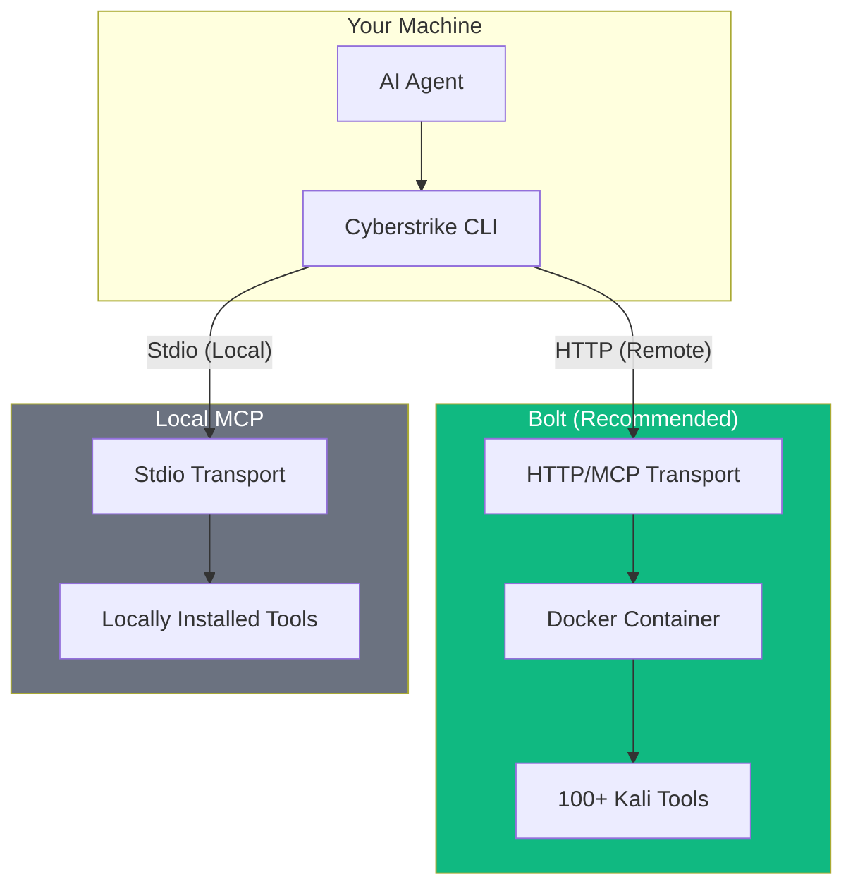
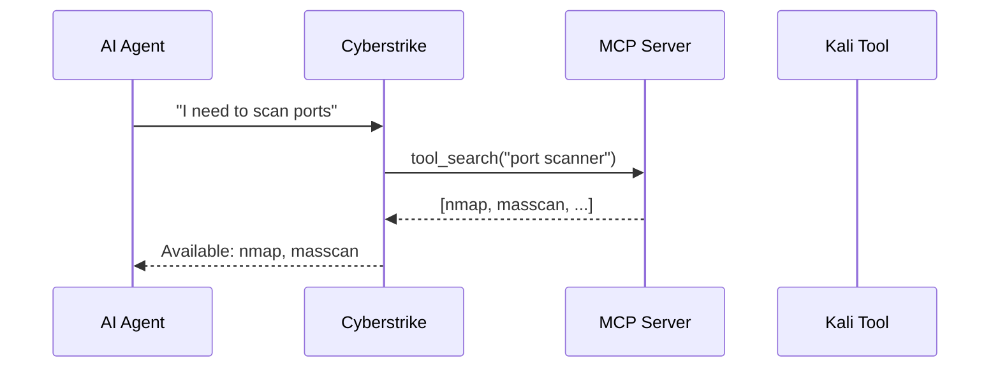
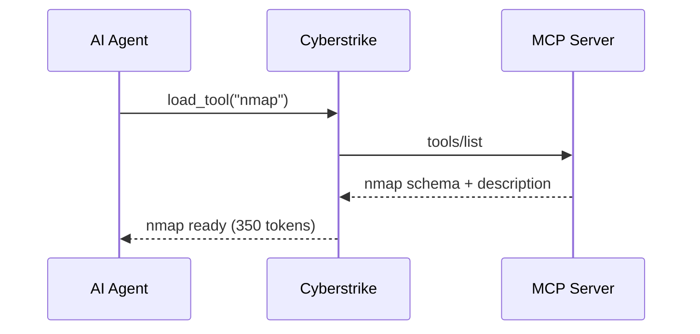
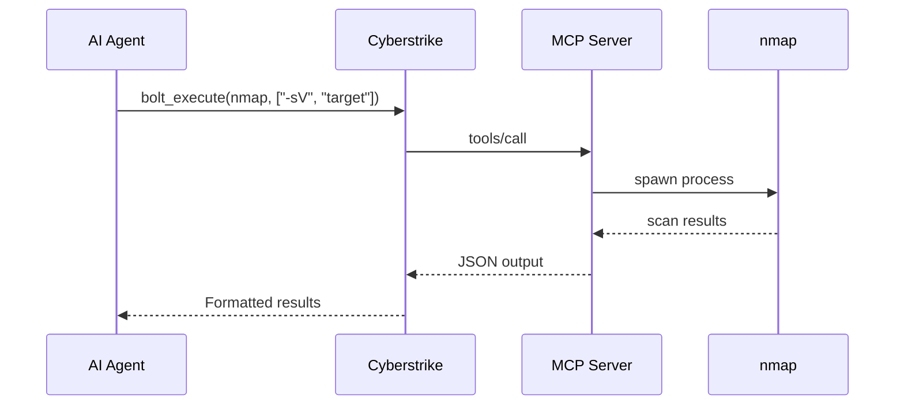
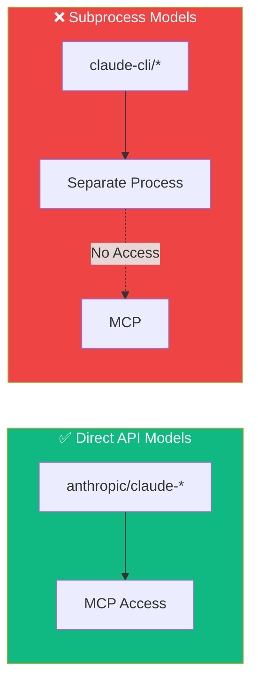

Cyberstrike uses the Model Context Protocol (MCP) to integrate with external security tools. **Bolt** is our recommended way to access 100+ Kali Linux tools through a Docker container.

{/* Architecture Overview - MARP Presentation Slide */}
<div className="border-2 border-dashed border-gray-400 dark:border-gray-600 rounded-lg p-8 my-6 text-center bg-gray-100 dark:bg-gray-800">
  <p className="text-gray-500 dark:text-gray-400 font-mono text-sm">🎞️ MARP SLIDE: architecture-overview.md</p>
  <p className="text-gray-400 dark:text-gray-500 text-xs mt-2">Bolt/MCP architecture overview presentation slide</p>
</div>

{/* Hero GIF - Tool execution demo */}
<div className="border-2 border-dashed border-gray-400 dark:border-gray-600 rounded-lg p-8 my-6 text-center bg-gray-100 dark:bg-gray-800">
  <p className="text-gray-500 dark:text-gray-400 font-mono text-sm">🎬 GIF: bolt-tool-execution.gif</p>
  <p className="text-gray-400 dark:text-gray-500 text-xs mt-2">Bolt tool execution demo - nmap scan (20s)</p>
</div>

## Architecture Overview

Cyberstrike provides two approaches to access security tools:



| Approach | Pros | Cons |
|----------|------|------|
| **Bolt (Remote)** | Pre-installed tools, Docker isolation, easy setup | Network latency, Docker required |
| **Local MCP** | Zero latency, offline operation | Manual tool installation, no isolation |

---

## Quick Comparison

{/* Comparison Screenshot */}
<div className="border-2 border-dashed border-gray-400 dark:border-gray-600 rounded-lg p-8 my-6 text-center bg-gray-100 dark:bg-gray-800">
  <p className="text-gray-500 dark:text-gray-400 font-mono text-sm">📸 SCREENSHOT: bolt-vs-local-comparison.png</p>
  <p className="text-gray-400 dark:text-gray-500 text-xs mt-2">Side-by-side comparison of Bolt and Local MCP setup</p>
</div>

### Bolt (Recommended)

```bash
# One command to start
curl -sSL https://bolt.cyberstrike.io/install.sh | bash
```

- 100+ pre-installed Kali tools
- Docker-based isolation
- Ed25519 authentication
- Optional port knocking
- Works on any platform

### Local MCP

```json title="cyberstrike.json"
{
  "mcp": {
    "kali": {
      "type": "local",
      "command": ["npx", "@cyberstrike/mcp-kali"]
    }
  }
}
```

- Requires tools installed locally
- Direct system access
- Zero network latency
- Best for offline use

---

## How It Works

{/* MARP Slide - Data Flow */}
<div className="border-2 border-dashed border-gray-400 dark:border-gray-600 rounded-lg p-8 my-6 text-center bg-gray-100 dark:bg-gray-800">
  <p className="text-gray-500 dark:text-gray-400 font-mono text-sm">🎞️ MARP SLIDE: data-flow.md</p>
  <p className="text-gray-400 dark:text-gray-500 text-xs mt-2">MCP data flow between Cyberstrike and tools</p>
</div>

### 1. Tool Discovery

The AI agent searches for needed capabilities:



{/* GIF - Tool Discovery */}
<div className="border-2 border-dashed border-gray-400 dark:border-gray-600 rounded-lg p-8 my-6 text-center bg-gray-100 dark:bg-gray-800">
  <p className="text-gray-500 dark:text-gray-400 font-mono text-sm">🎬 GIF: tool-discovery.gif</p>
  <p className="text-gray-400 dark:text-gray-500 text-xs mt-2">Tool search and discovery flow (15s)</p>
</div>

### 2. Tool Loading

Selected tools are loaded into the agent's context:



### 3. Tool Execution

The agent calls tools with appropriate arguments:



{/* GIF - Tool Execution */}
<div className="border-2 border-dashed border-gray-400 dark:border-gray-600 rounded-lg p-8 my-6 text-center bg-gray-100 dark:bg-gray-800">
  <p className="text-gray-500 dark:text-gray-400 font-mono text-sm">🎬 GIF: tool-execution-flow.gif</p>
  <p className="text-gray-400 dark:text-gray-500 text-xs mt-2">Complete tool execution flow (20s)</p>
</div>

---

## Dynamic Tool Loading

Cyberstrike uses a dynamic loading system to manage 100+ tools without overwhelming the AI context window.

{/* MARP Slide - Token Budget */}
<div className="border-2 border-dashed border-gray-400 dark:border-gray-600 rounded-lg p-8 my-6 text-center bg-gray-100 dark:bg-gray-800">
  <p className="text-gray-500 dark:text-gray-400 font-mono text-sm">🎞️ MARP SLIDE: token-budget.md</p>
  <p className="text-gray-400 dark:text-gray-500 text-xs mt-2">Dynamic tool loading and token budget management</p>
</div>

### Token Budget System

Each tool consumes context tokens based on its schema complexity:

| Tool | Estimated Tokens |
|------|------------------|
| nmap | ~350 |
| sqlmap | ~500 |
| nuclei | ~400 |
| metasploit | ~800 |

Default budget: **20,000 tokens** for MCP tools

### Meta-Tools

These tools manage the dynamic loading system:

| Tool | Description |
|------|-------------|
| `tool_search` | Search available tools by name/description |
| `load_tools` | Load tools into current session |
| `unload_tools` | Remove tools to free budget |
| `list_loaded_tools` | Show loaded tools and token usage |

{/* Screenshot - Token Budget UI */}
<div className="border-2 border-dashed border-gray-400 dark:border-gray-600 rounded-lg p-8 my-6 text-center bg-gray-100 dark:bg-gray-800">
  <p className="text-gray-500 dark:text-gray-400 font-mono text-sm">📸 SCREENSHOT: token-budget-ui.png</p>
  <p className="text-gray-400 dark:text-gray-500 text-xs mt-2">Token budget indicator in TUI status bar</p>
</div>

---

## TUI Management

Use the `/bolt` command to manage **all MCP servers** (both local and remote) in the TUI:

{/* GIF - /bolt command */}
<div className="border-2 border-dashed border-gray-400 dark:border-gray-600 rounded-lg p-8 my-6 text-center bg-gray-100 dark:bg-gray-800">
  <p className="text-gray-500 dark:text-gray-400 font-mono text-sm">🎬 GIF: bolt-tui-management.gif</p>
  <p className="text-gray-400 dark:text-gray-500 text-xs mt-2">/bolt command demo - add, toggle, delete servers (25s)</p>
</div>

### Keyboard Shortcuts

| Key | Action |
|-----|--------|
| **a** | Add new MCP server (local or remote) |
| **space** | Toggle connection |
| **d** | Delete server |
| **esc** | Close dialog |

### Status Indicators

| Icon | Status |
|------|--------|
| ⚡ | Bolt container (Kali tools) |
| ◆ | Local MCP server (stdio) |
| ◇ | Remote MCP server (HTTP) |

**Connection States:**
- Green = Connected
- Gray = Disabled
- Red = Failed
- Yellow = Needs Auth

{/* Screenshot - Bolt Dialog */}
<div className="border-2 border-dashed border-gray-400 dark:border-gray-600 rounded-lg p-8 my-6 text-center bg-gray-100 dark:bg-gray-800">
  <p className="text-gray-500 dark:text-gray-400 font-mono text-sm">📸 SCREENSHOT: bolt-dialog-states.png</p>
  <p className="text-gray-400 dark:text-gray-500 text-xs mt-2">Bolt dialog showing different server states</p>
</div>

---

## Model Compatibility

<Aside variant="caution">
  **Important**: Subprocess models cannot access MCP tools. Use direct API models for full Bolt integration.
</Aside>

{/* MARP Slide - Model Compatibility */}
<div className="border-2 border-dashed border-gray-400 dark:border-gray-600 rounded-lg p-8 my-6 text-center bg-gray-100 dark:bg-gray-800">
  <p className="text-gray-500 dark:text-gray-400 font-mono text-sm">🎞️ MARP SLIDE: model-compatibility.md</p>
  <p className="text-gray-400 dark:text-gray-500 text-xs mt-2">Which AI models work with Bolt/MCP</p>
</div>

### Supported Models (Direct API)

These models run within Cyberstrike and have full MCP access:

- `anthropic/claude-sonnet-4`
- `anthropic/claude-opus-4`
- `openai/gpt-4o`
- `openai/gpt-4o-mini`

### Unsupported Models (Subprocess)

These models run as separate processes and **cannot** access MCP:

- `claude-cli/opus` (runs claude CLI as subprocess)
- `claude-cli/sonnet`
- Any subprocess-based model



---

## Configuration Locations

MCP servers can be configured at multiple levels:

| Location | Scope | Priority |
|----------|-------|----------|
| `./cyberstrike.json` | Project | Highest |
| `./.cyberstrike/cyberstrike.json` | Project | High |
| `~/.config/cyberstrike/cyberstrike.json` | Global | Low |

Project configuration overrides global configuration.

{/* Screenshot - Config file example */}
<div className="border-2 border-dashed border-gray-400 dark:border-gray-600 rounded-lg p-8 my-6 text-center bg-gray-100 dark:bg-gray-800">
  <p className="text-gray-500 dark:text-gray-400 font-mono text-sm">📸 SCREENSHOT: config-locations.png</p>
  <p className="text-gray-400 dark:text-gray-500 text-xs mt-2">Configuration file hierarchy visualization</p>
</div>

---

## Getting Started

### Option 1: Bolt (Recommended)

1. **Start Bolt server**:
   ```bash
   curl -sSL https://bolt.cyberstrike.io/install.sh | bash
   ```

2. **Get admin token**:
   ```bash
   docker logs bolt | grep "Admin token"
   ```

3. **Add in TUI**: Press `/bolt` → `a` → Enter URL and token

See [Bolt documentation](/docs/mcp/bolt) for full details.

### Option 2: Local MCP

1. **Install tools locally** (nmap, sqlmap, etc.)

2. **Configure MCP**:
   ```json title="cyberstrike.json"
   {
     "mcp": {
       "kali": {
         "type": "local",
         "command": ["npx", "@cyberstrike/mcp-kali"]
       }
     }
   }
   ```

See [Local Servers](/docs/mcp/local-servers) for details.

---

## Documentation Structure

| Page | Description |
|------|-------------|
| [Bolt](/docs/mcp/bolt) | Docker-based Kali tools (recommended) |
| [Local Servers](/docs/mcp/local-servers) | Locally running MCP servers |
| [Remote Servers](/docs/mcp/remote-servers) | HTTP/SSE remote connections |
| [OAuth](/docs/mcp/oauth) | OAuth authentication setup |
| [Creating Servers](/docs/mcp/creating-servers) | Build custom MCP servers |

{/* MARP Slide - Documentation Map */}
<div className="border-2 border-dashed border-gray-400 dark:border-gray-600 rounded-lg p-8 my-6 text-center bg-gray-100 dark:bg-gray-800">
  <p className="text-gray-500 dark:text-gray-400 font-mono text-sm">🎞️ MARP SLIDE: documentation-map.md</p>
  <p className="text-gray-400 dark:text-gray-500 text-xs mt-2">Visual map of Bolt/MCP documentation</p>
</div>

<Aside variant="danger">
  Only use security tools against authorized targets. Unauthorized penetration testing is illegal.
</Aside>
