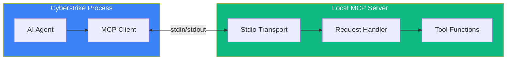

Local MCP servers run on your machine as child processes, communicating via stdio. This is an alternative to [Bolt](/docs/mcp/bolt) for users who prefer to run tools directly on their system.

<Aside variant="tip">
  **Prefer Bolt for security tools.** Local MCP requires manual tool installation. See [Bolt](/docs/mcp/bolt) for the recommended approach with 100+ pre-installed Kali tools.
</Aside>

{/* MARP Slide - Local vs Remote Architecture */}
<div className="border-2 border-dashed border-gray-400 dark:border-gray-600 rounded-lg p-8 my-6 text-center bg-gray-100 dark:bg-gray-800">
  <p className="text-gray-500 dark:text-gray-400 font-mono text-sm">🎞️ MARP SLIDE: local-architecture.md</p>
  <p className="text-gray-400 dark:text-gray-500 text-xs mt-2">Local MCP stdio transport architecture</p>
</div>

{/* Screenshot - Local MCP server configuration */}
<div className="border-2 border-dashed border-gray-400 dark:border-gray-600 rounded-lg p-8 my-6 text-center bg-gray-100 dark:bg-gray-800">
  <p className="text-gray-500 dark:text-gray-400 font-mono text-sm">📸 SCREENSHOT: local-mcp-config.png</p>
  <p className="text-gray-400 dark:text-gray-500 text-xs mt-2">Local MCP server configuration in cyberstrike.json</p>
</div>

## When to Use Local MCP

Local MCP servers are best for:

- **Offline environments** - No network access required
- **Low latency** - Direct process communication
- **Custom tools** - Your own MCP servers
- **Privacy** - Data never leaves your machine

## Architecture



## Overview

Local MCP servers offer:

- Zero network latency
- Full data privacy
- Offline operation
- Custom tool integration
- Direct system access

## Configuration

### Basic Setup

```json title="~/.cyberstrike/config.json"
{
  "mcp": {
    "servers": {
      "my-tools": {
        "command": "node",
        "args": ["./mcp-server/index.js"]
      }
    }
  }
}
```

### Project-Level Configuration

```json title="cyberstrike.json"
{
  "mcp": {
    "servers": {
      "project-tools": {
        "command": "python",
        "args": ["-m", "project_mcp"]
      }
    }
  }
}
```

## Server Types

### Node.js Servers

```json
{
  "mcp": {
    "servers": {
      "node-tools": {
        "command": "npx",
        "args": ["-y", "@modelcontextprotocol/server-filesystem"]
      }
    }
  }
}
```

### Python Servers

```json
{
  "mcp": {
    "servers": {
      "python-tools": {
        "command": "python",
        "args": ["-m", "mcp_server"]
      }
    }
  }
}
```

### Binary Executables

```json
{
  "mcp": {
    "servers": {
      "binary-tools": {
        "command": "/usr/local/bin/mcp-scanner"
      }
    }
  }
}
```

### Docker Containers

```json
{
  "mcp": {
    "servers": {
      "docker-tools": {
        "command": "docker",
        "args": ["run", "-i", "--rm", "mcp-tools:latest"]
      }
    }
  }
}
```

## Environment Variables

### Pass to Server

```json
{
  "mcp": {
    "servers": {
      "api-tools": {
        "command": "node",
        "args": ["server.js"],
        "env": {
          "API_KEY": "{env:MY_API_KEY}",
          "DEBUG": "true"
        }
      }
    }
  }
}
```

### Inherit Environment

```json
{
  "mcp": {
    "servers": {
      "tools": {
        "command": "python",
        "args": ["server.py"],
        "inheritEnv": true
      }
    }
  }
}
```

## Working Directory

### Set Working Directory

```json
{
  "mcp": {
    "servers": {
      "project-tools": {
        "command": "node",
        "args": ["server.js"],
        "cwd": "/path/to/project"
      }
    }
  }
}
```

### Relative Paths

```json
{
  "mcp": {
    "servers": {
      "local-tools": {
        "command": "./scripts/mcp-server.sh"
      }
    }
  }
}
```

## Popular Local Servers

### Filesystem Server

Access files and directories:

```json
{
  "mcp": {
    "servers": {
      "filesystem": {
        "command": "npx",
        "args": ["-y", "@modelcontextprotocol/server-filesystem", "/path/to/allow"]
      }
    }
  }
}
```

### SQLite Server

Query local databases:

```json
{
  "mcp": {
    "servers": {
      "sqlite": {
        "command": "npx",
        "args": ["-y", "@modelcontextprotocol/server-sqlite", "--db", "data.db"]
      }
    }
  }
}
```

### Git Server

Git operations:

```json
{
  "mcp": {
    "servers": {
      "git": {
        "command": "npx",
        "args": ["-y", "@modelcontextprotocol/server-git"]
      }
    }
  }
}
```

## Server Lifecycle

### Startup

Servers start when:
- Cyberstrike launches (if configured)
- First tool from server is used (lazy start)

### Auto-Start

```json
{
  "mcp": {
    "servers": {
      "tools": {
        "command": "node",
        "args": ["server.js"],
        "autoStart": true
      }
    }
  }
}
```

### Lazy Start

```json
{
  "mcp": {
    "servers": {
      "tools": {
        "command": "node",
        "args": ["server.js"],
        "autoStart": false
      }
    }
  }
}
```

### Restart on Failure

```json
{
  "mcp": {
    "servers": {
      "tools": {
        "command": "node",
        "args": ["server.js"],
        "restart": {
          "enabled": true,
          "maxRetries": 3,
          "delay": 1000
        }
      }
    }
  }
}
```

## Health Checks

### Timeout Configuration

```json
{
  "mcp": {
    "servers": {
      "tools": {
        "command": "node",
        "args": ["server.js"],
        "timeout": 30000
      }
    }
  }
}
```

### Connection Verification

```
> Check MCP server status
```

Output:

```
MCP Server Status:
- my-tools: connected (5 tools)
- filesystem: connected (3 tools)
- sqlite: disconnected (starting...)
```

## Resource Limits

### Memory Limits

```json
{
  "mcp": {
    "servers": {
      "tools": {
        "command": "node",
        "args": ["--max-old-space-size=512", "server.js"]
      }
    }
  }
}
```

### CPU Priority

```json
{
  "mcp": {
    "servers": {
      "tools": {
        "command": "nice",
        "args": ["-n", "10", "node", "server.js"]
      }
    }
  }
}
```

## Security Considerations

### Sandboxing

```json
{
  "mcp": {
    "servers": {
      "untrusted": {
        "command": "docker",
        "args": ["run", "--rm", "-i", "--network=none", "mcp-server"]
      }
    }
  }
}
```

### Permission Restrictions

```json
{
  "mcp": {
    "servers": {
      "readonly": {
        "command": "node",
        "args": ["server.js"],
        "permissions": {
          "filesystem": "read",
          "network": false
        }
      }
    }
  }
}
```

## Debugging

### Enable Logging

```json
{
  "mcp": {
    "servers": {
      "tools": {
        "command": "node",
        "args": ["server.js"],
        "env": {
          "DEBUG": "mcp:*"
        }
      }
    }
  }
}
```

### View Logs

```bash
# Server logs location
tail -f ~/.cyberstrike/logs/mcp-my-tools.log
```

### Manual Testing

```bash
# Test server directly
echo '{"jsonrpc":"2.0","method":"tools/list","id":1}' | node server.js
```

## Troubleshooting

### Server Not Starting

```
Error: Failed to start MCP server: my-tools
```

Check:
- Command exists and is executable
- Working directory is correct
- Dependencies are installed

### Connection Timeout

```
Error: MCP server connection timeout
```

Solutions:
- Increase timeout value
- Check server startup time
- Verify server is responding

### Tool Not Found

```
Error: Tool not found: my-tools/scanner
```

Verify:
- Server is running
- Tool is exported by server
- Tool name is correct

<Aside variant="tip">
  Use lazy start for servers with slow startup times to avoid slowing down Cyberstrike launch.
</Aside>

## Related Documentation

- [Bolt / MCP Overview](/docs/mcp) - Architecture and concepts
- [Bolt](/docs/mcp/bolt) - Docker-based Kali tools (recommended)
- [Remote Servers](/docs/mcp/remote-servers) - Remote MCP configuration
- [Creating Servers](/docs/mcp/creating-servers) - Build custom servers
