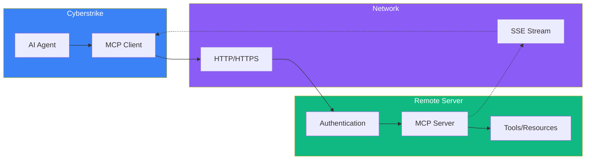

Remote MCP servers connect over HTTP/HTTPS, enabling access to hosted services and shared infrastructure. [Bolt](/docs/mcp/bolt) is the primary example of a remote MCP server for security tools.

<Aside variant="tip">
  **Looking for security tools?** See [Bolt](/docs/mcp/bolt) for 100+ pre-installed Kali tools via Docker. This page covers general remote MCP configuration.
</Aside>

{/* MARP Slide - Remote Transport Options */}
<div className="border-2 border-dashed border-gray-400 dark:border-gray-600 rounded-lg p-8 my-6 text-center bg-gray-100 dark:bg-gray-800">
  <p className="text-gray-500 dark:text-gray-400 font-mono text-sm">🎞️ MARP SLIDE: remote-transport.md</p>
  <p className="text-gray-400 dark:text-gray-500 text-xs mt-2">HTTP, SSE, and WebSocket transport options</p>
</div>

{/* Diagram - Remote MCP architecture */}
<div className="border-2 border-dashed border-gray-400 dark:border-gray-600 rounded-lg p-8 my-6 text-center bg-gray-100 dark:bg-gray-800">
  <p className="text-gray-500 dark:text-gray-400 font-mono text-sm">📊 DIAGRAM: remote-mcp-architecture.mmd</p>
  <p className="text-gray-400 dark:text-gray-500 text-xs mt-2">Remote MCP server architecture</p>
</div>

## Architecture



## Overview

Remote MCP servers enable:

- Shared tool infrastructure
- Hosted security services
- Team collaboration
- Cloud-based capabilities
- Enterprise integrations

## Connection Types

### HTTP/SSE (Server-Sent Events)

Standard remote connection:

```json title="~/.cyberstrike/config.json"
{
  "mcp": {
    "servers": {
      "remote-tools": {
        "url": "https://mcp.example.com/sse"
      }
    }
  }
}
```

### WebSocket

For bidirectional communication:

```json
{
  "mcp": {
    "servers": {
      "ws-tools": {
        "url": "wss://mcp.example.com/ws"
      }
    }
  }
}
```

## Authentication

### API Key

```json
{
  "mcp": {
    "servers": {
      "remote-tools": {
        "url": "https://mcp.example.com/sse",
        "headers": {
          "Authorization": "Bearer {env:MCP_API_KEY}"
        }
      }
    }
  }
}
```

### OAuth 2.0

```json
{
  "mcp": {
    "servers": {
      "oauth-tools": {
        "url": "https://mcp.example.com/sse",
        "oauth": {
          "clientId": "{env:OAUTH_CLIENT_ID}",
          "clientSecret": "{env:OAUTH_CLIENT_SECRET}",
          "tokenUrl": "https://auth.example.com/token"
        }
      }
    }
  }
}
```

### Custom Headers

```json
{
  "mcp": {
    "servers": {
      "custom-auth": {
        "url": "https://mcp.example.com/sse",
        "headers": {
          "X-API-Key": "{env:API_KEY}",
          "X-Tenant-ID": "my-tenant"
        }
      }
    }
  }
}
```

## Popular Remote Servers

### Cloudflare MCP

```json
{
  "mcp": {
    "servers": {
      "cloudflare": {
        "url": "https://mcp.cloudflare.com/sse",
        "headers": {
          "Authorization": "Bearer {env:CF_API_TOKEN}"
        }
      }
    }
  }
}
```

### GitHub MCP

```json
{
  "mcp": {
    "servers": {
      "github": {
        "url": "https://mcp.github.com/sse",
        "oauth": {
          "clientId": "{env:GH_CLIENT_ID}",
          "scope": "repo,read:user"
        }
      }
    }
  }
}
```

### Custom Enterprise

```json
{
  "mcp": {
    "servers": {
      "enterprise-tools": {
        "url": "https://mcp.internal.company.com/sse",
        "headers": {
          "Authorization": "Bearer {env:ENTERPRISE_TOKEN}"
        }
      }
    }
  }
}
```

## Connection Options

### Timeout

```json
{
  "mcp": {
    "servers": {
      "remote": {
        "url": "https://mcp.example.com/sse",
        "timeout": 60000
      }
    }
  }
}
```

### Retry Configuration

```json
{
  "mcp": {
    "servers": {
      "remote": {
        "url": "https://mcp.example.com/sse",
        "retry": {
          "enabled": true,
          "maxRetries": 3,
          "backoff": "exponential"
        }
      }
    }
  }
}
```

### Keepalive

```json
{
  "mcp": {
    "servers": {
      "remote": {
        "url": "https://mcp.example.com/sse",
        "keepalive": {
          "enabled": true,
          "interval": 30000
        }
      }
    }
  }
}
```

## Proxy Configuration

### HTTP Proxy

```json
{
  "mcp": {
    "servers": {
      "remote": {
        "url": "https://mcp.example.com/sse",
        "proxy": "http://proxy.company.com:8080"
      }
    }
  }
}
```

### SOCKS Proxy

```json
{
  "mcp": {
    "servers": {
      "remote": {
        "url": "https://mcp.example.com/sse",
        "proxy": "socks5://localhost:1080"
      }
    }
  }
}
```

### No Proxy

```json
{
  "mcp": {
    "servers": {
      "internal": {
        "url": "https://mcp.internal.company.com/sse",
        "noProxy": true
      }
    }
  }
}
```

## SSL/TLS

### Custom CA Certificate

```json
{
  "mcp": {
    "servers": {
      "remote": {
        "url": "https://mcp.example.com/sse",
        "ca": "/path/to/ca-cert.pem"
      }
    }
  }
}
```

### Client Certificate

```json
{
  "mcp": {
    "servers": {
      "mtls": {
        "url": "https://mcp.example.com/sse",
        "cert": "/path/to/client-cert.pem",
        "key": "/path/to/client-key.pem"
      }
    }
  }
}
```

### Skip Verification (Development Only)

```json
{
  "mcp": {
    "servers": {
      "dev": {
        "url": "https://localhost:8443/sse",
        "insecure": true
      }
    }
  }
}
```

<Aside variant="danger">
  Never use insecure connections in production. This bypasses SSL certificate verification.
</Aside>

## Load Balancing

### Multiple Endpoints

```json
{
  "mcp": {
    "servers": {
      "ha-tools": {
        "urls": [
          "https://mcp1.example.com/sse",
          "https://mcp2.example.com/sse",
          "https://mcp3.example.com/sse"
        ],
        "loadBalance": "round-robin"
      }
    }
  }
}
```

### Failover

```json
{
  "mcp": {
    "servers": {
      "failover-tools": {
        "urls": [
          "https://mcp-primary.example.com/sse",
          "https://mcp-secondary.example.com/sse"
        ],
        "loadBalance": "failover"
      }
    }
  }
}
```

## Health Monitoring

### Connection Status

```
> Show MCP server status
```

Output:

```
Remote MCP Servers:
- cloudflare: connected (latency: 45ms)
- github: connected (latency: 120ms)
- enterprise: disconnected (retrying...)
```

### Latency Check

```
> Check latency to remote MCP servers
```

### Automatic Reconnection

Cyberstrike automatically reconnects on connection loss with exponential backoff.

## Security Considerations

### Token Security

1. Store tokens in environment variables
2. Use short-lived tokens when possible
3. Implement token rotation
4. Monitor token usage

### Network Security

1. Use HTTPS only
2. Verify SSL certificates
3. Use VPN for internal servers
4. Implement IP allowlisting

### Data Privacy

1. Review data sent to remote servers
2. Understand data retention policies
3. Use local servers for sensitive data
4. Implement data masking if needed

## Troubleshooting

### Connection Refused

```
Error: Connection refused: https://mcp.example.com
```

Check:
- Server is running
- URL is correct
- Firewall allows connection

### Authentication Failed

```
Error: 401 Unauthorized
```

Verify:
- API key is correct
- Token hasn't expired
- Headers are properly formatted

### Timeout

```
Error: Connection timeout
```

Solutions:
- Increase timeout value
- Check network connectivity
- Verify server is responsive

### SSL Error

```
Error: SSL certificate problem
```

Check:
- Certificate is valid
- CA is trusted
- System time is correct

<Aside variant="tip">
  Use local servers for latency-sensitive operations and remote servers for shared capabilities.
</Aside>

## Related Documentation

- [Bolt / MCP Overview](/docs/mcp) - Architecture and concepts
- [Bolt](/docs/mcp/bolt) - Docker-based Kali tools (recommended)
- [Local Servers](/docs/mcp/local-servers) - Local MCP servers
- [OAuth Configuration](/docs/mcp/oauth) - OAuth setup
