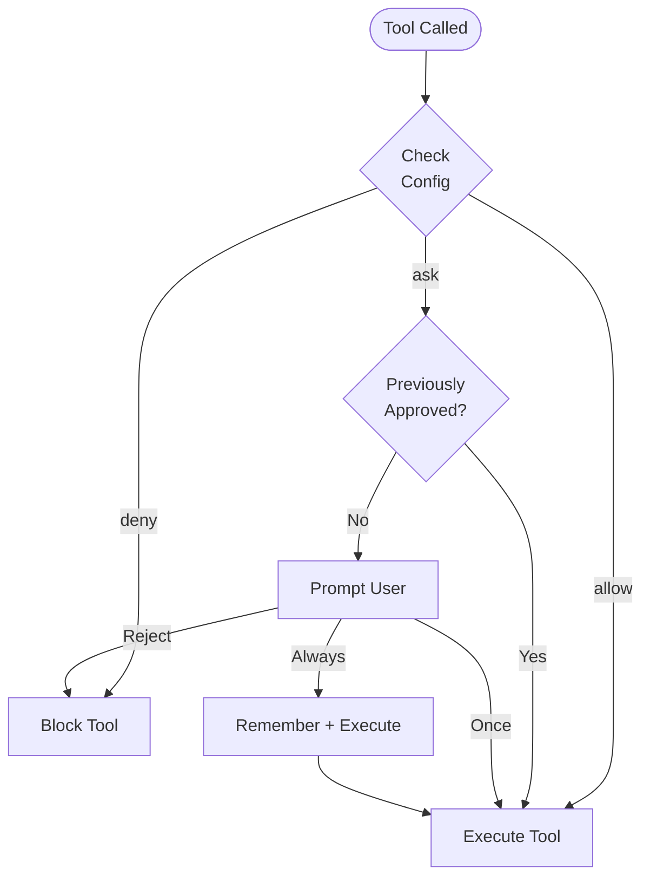

Cyberstrike uses a permission system to control which tools the AI agent can execute. This provides security boundaries while maintaining productivity.

{/* TODO: GIF - Plan mode workflow */}
<div className="border-2 border-dashed border-gray-400 dark:border-gray-600 rounded-lg p-8 my-6 text-center bg-gray-100 dark:bg-gray-800">
  <p className="text-gray-500 dark:text-gray-400 font-mono text-sm">🎬 GIF: g04-plan-mode.gif</p>
  <p className="text-gray-400 dark:text-gray-500 text-xs mt-2">Plan mode iş akışı demosu (20s)</p>
</div>

{/* TODO: Screenshot - Permission prompt */}
<div className="border-2 border-dashed border-gray-400 dark:border-gray-600 rounded-lg p-8 my-6 text-center bg-gray-100 dark:bg-gray-800">
  <p className="text-gray-500 dark:text-gray-400 font-mono text-sm">📸 SCREENSHOT: s06-permission-prompt.png</p>
  <p className="text-gray-400 dark:text-gray-500 text-xs mt-2">İzin istemi görünümü</p>
</div>

{/* TODO: Screenshot - Plan mode UI */}
<div className="border-2 border-dashed border-gray-400 dark:border-gray-600 rounded-lg p-8 my-6 text-center bg-gray-100 dark:bg-gray-800">
  <p className="text-gray-500 dark:text-gray-400 font-mono text-sm">📸 SCREENSHOT: s07-plan-mode.png</p>
  <p className="text-gray-400 dark:text-gray-500 text-xs mt-2">Plan mode arayüzü</p>
</div>

## Permission Model



---

## Permission Modes

| Mode | Behavior | Use Case |
|------|----------|----------|
| `ask` | Prompt for approval | Default for sensitive tools |
| `allow` | Auto-approve | Trusted tools, automation |
| `deny` | Block execution | Restricted operations |

---

## Configuring Permissions

### Global Configuration

Set permissions in `~/.cyberstrike/config.json`:

```json title="~/.cyberstrike/config.json"
{
  "permission": {
    "read": "allow",
    "glob": "allow",
    "grep": "allow",
    "edit": "ask",
    "bash": "ask",
    "websearch": "ask"
  }
}
```

### Project Configuration

Override permissions per-project in `cyberstrike.json`:

```json title="cyberstrike.json"
{
  "permission": {
    "bash": "allow",
    "edit": "allow",
    "external_directory": "deny"
  }
}
```

Project settings override global settings.

---

## Permission Types

### File Operations

| Permission | Tools | Default | Description |
|------------|-------|---------|-------------|
| `read` | Read | `ask` | Read file contents |
| `edit` | Write, Edit | `ask` | Modify files |
| `glob` | Glob | `allow` | Find files by pattern |
| `grep` | Grep | `allow` | Search file contents |

### Command Execution

| Permission | Tools | Default | Description |
|------------|-------|---------|-------------|
| `bash` | Bash | `ask` | Execute shell commands |
| `task` | Task | `ask` | Create sub-agents |

### Web Operations

| Permission | Tools | Default | Description |
|------------|-------|---------|-------------|
| `websearch` | WebSearch | `ask` | Search the web |
| `webfetch` | WebFetch | `ask` | Fetch web content |
| `codesearch` | CodeSearch | `ask` | Search code repositories |

### Special Permissions

| Permission | Description |
|------------|-------------|
| `external_directory` | Access files outside project |
| `lsp` | Language server operations |
| `doom_loop` | Detect and break infinite loops |

---

## Pattern-Based Permissions

Use patterns to grant granular permissions.

### Directory Patterns

Allow specific directories:

```json
{
  "permission": {
    "read": {
      "src/**": "allow",
      "test/**": "allow",
      "node_modules/**": "deny"
    },
    "edit": {
      "src/**": "allow",
      "*.config.js": "deny"
    }
  }
}
```

### Command Patterns

Allow specific commands:

```json
{
  "permission": {
    "bash": {
      "git *": "allow",
      "npm test": "allow",
      "npm run *": "allow",
      "rm *": "deny"
    }
  }
}
```

### Wildcard Matching

| Pattern | Matches |
|---------|---------|
| `*` | Any single path segment |
| `**` | Any path depth |
| `*.ts` | Files ending in .ts |
| `src/**/*.ts` | TypeScript files in src |

---

## Agent Permissions

Configure permissions per-agent:

```json title="cyberstrike.json"
{
  "agent": {
    "web-application": {
      "permission": {
        "bash": "allow",
        "browser": "allow",
        "edit": "ask"
      }
    },
    "code-review": {
      "permission": {
        "read": "allow",
        "glob": "allow",
        "grep": "allow",
        "edit": "deny",
        "bash": "deny"
      }
    }
  }
}
```

---

## Interactive Approval

When a tool requires permission, Cyberstrike prompts for approval.

### Response Options

| Option | Behavior |
|--------|----------|
| **Once** | Approve this specific call |
| **Always** | Approve all similar calls in session |
| **Reject** | Block this call |

### Approval Dialog

```
┌─────────────────────────────────────────┐
│  Permission Required                     │
├─────────────────────────────────────────┤
│  Tool: Bash                              │
│  Command: git push origin main           │
│                                          │
│  [Once]  [Always]  [Reject]              │
└─────────────────────────────────────────┘
```

### Keyboard Shortcuts

| Key | Action |
|-----|--------|
| `y` | Approve once |
| `a` | Approve always |
| `n` | Reject |
| `Esc` | Reject |

---

## Session Approval Memory

When you select "Always", Cyberstrike remembers the approval pattern for the session.

### How Memory Works

1. User approves `git push` with "Always"
2. Pattern `git *` is stored for session
3. Future `git pull`, `git commit`, etc. auto-approve
4. Memory resets when session ends

### Viewing Approved Patterns

Approved patterns persist until session restart.

---

## Automation Mode

For CI/CD and automation, configure full trust:

```json title="cyberstrike.json"
{
  "permission": "allow"
}
```

This sets all permissions to allow without prompting.

<Aside variant="caution">
  Using `"permission": "allow"` bypasses all safety checks. Use only in controlled environments.
</Aside>

---

## Read-Only Mode

Restrict the agent to read-only operations:

```json title="cyberstrike.json"
{
  "permission": {
    "read": "allow",
    "glob": "allow",
    "grep": "allow",
    "lsp": "allow",
    "edit": "deny",
    "bash": "deny",
    "websearch": "deny"
  }
}
```

Use this for code review or exploration tasks.

---

## External Directory Access

By default, Cyberstrike restricts access to the project directory.

### Allowing External Access

```json
{
  "permission": {
    "external_directory": "ask"
  }
}
```

### Specific External Paths

```json
{
  "permission": {
    "external_directory": {
      "/home/user/shared/**": "allow",
      "/tmp/**": "allow",
      "/etc/**": "deny"
    }
  }
}
```

---

## Permission Hooks

Use plugin hooks for programmatic permission control.

### permission.ask Hook

```typescript
const hooks: Hooks = {
  "permission.ask": async (input, output) => {
    // Auto-approve read operations in src
    if (input.type === "read" && input.path?.startsWith("src/")) {
      output.status = "allow"
      return
    }

    // Block access to secrets
    if (input.path?.includes("secret") || input.path?.includes(".env")) {
      output.status = "deny"
      return
    }

    // Default: prompt user
    output.status = "ask"
  },
}
```

### Hook Input

| Field | Type | Description |
|-------|------|-------------|
| `id` | string | Permission request ID |
| `type` | string | Permission type |
| `pattern` | string | Matching pattern |
| `sessionID` | string | Session identifier |
| `messageID` | string | Message identifier |
| `callID` | string | Tool call ID |
| `message` | string | Description |
| `metadata` | object | Additional context |

### Hook Output

| Field | Value | Description |
|-------|-------|-------------|
| `status` | `"ask"` | Prompt user |
| `status` | `"allow"` | Auto-approve |
| `status` | `"deny"` | Block |

---

## Security Best Practices

### Development Environment

```json
{
  "permission": {
    "read": "allow",
    "glob": "allow",
    "grep": "allow",
    "edit": "ask",
    "bash": "ask"
  }
}
```

### Production/CI Environment

```json
{
  "permission": {
    "read": "allow",
    "glob": "allow",
    "grep": "allow",
    "edit": "allow",
    "bash": {
      "npm test": "allow",
      "npm run build": "allow",
      "*": "deny"
    }
  }
}
```

### Security Audit Mode

```json
{
  "permission": {
    "read": "allow",
    "glob": "allow",
    "grep": "allow",
    "lsp": "allow",
    "websearch": "allow",
    "edit": "deny",
    "bash": "deny"
  }
}
```

---

## Permission Priority

Permissions are evaluated in order:

1. **Agent-specific** permissions (highest priority)
2. **Project** `cyberstrike.json`
3. **Global** `~/.cyberstrike/config.json`
4. **Default** built-in values (lowest priority)

More specific patterns take precedence:

```json
{
  "permission": {
    "bash": "deny",
    "bash": {
      "git *": "allow"
    }
  }
}
```

In this case, `git push` is allowed but `rm -rf` is denied.

---

## Troubleshooting

### Permission Always Prompting

Check that your configuration is valid:

```bash
cyberstrike config validate
```

Verify the permission is set correctly:

```bash
cat ~/.cyberstrike/config.json | jq .permission
```

### Permission Not Applied

1. Check project vs global config priority
2. Verify pattern syntax matches the path
3. Restart Cyberstrike to reload config

### Blocked Operation

If a tool is unexpectedly blocked:

1. Check for `deny` rules in config
2. Check for pattern mismatches
3. Check plugin hooks that may block

---

## Examples

### Web Security Testing

```json title="cyberstrike.json"
{
  "permission": {
    "bash": {
      "nmap *": "allow",
      "nikto *": "allow",
      "sqlmap *": "allow",
      "nuclei *": "allow"
    },
    "browser": "allow",
    "websearch": "allow",
    "edit": "ask"
  }
}
```

### Code Review Only

```json title="cyberstrike.json"
{
  "permission": {
    "read": "allow",
    "glob": "allow",
    "grep": "allow",
    "lsp": "allow",
    "edit": "deny",
    "bash": "deny",
    "browser": "deny"
  }
}
```

### Full Automation

```json title="cyberstrike.json"
{
  "permission": "allow"
}
```

<Aside variant="tip">
  Start with restrictive permissions and relax them as needed. It's safer to approve individual actions than to grant blanket access.
</Aside>
