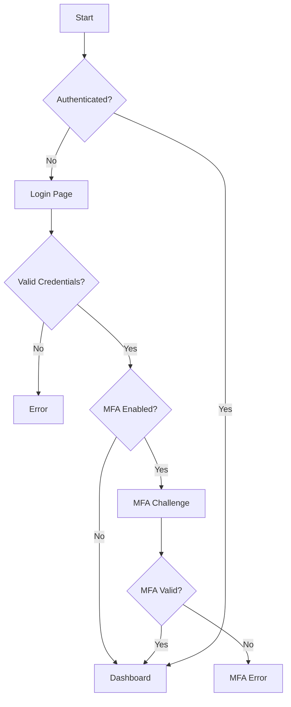

# WSTG-INFO-07: Map Execution Paths Through Application

## Test ID
WSTG-INFO-07

## Test Name
Map Execution Paths Through Application

## High-Level Description

Mapping execution paths involves understanding how users navigate through an application and identifying all possible workflows, decision points, and code paths. This foundational step ensures testers comprehend the application's structure before conducting comprehensive security testing. Understanding execution paths helps identify areas where security controls might be bypassed, business logic could be exploited, or race conditions might occur.

---

## What to Check

### Execution Path Elements

- [ ] User workflows and navigation patterns
- [ ] Decision points and branching logic
- [ ] Multi-step processes (checkout, registration, etc.)
- [ ] State-dependent functionality
- [ ] Role-based access paths
- [ ] Error handling flows
- [ ] Authentication/authorization gates
- [ ] Data validation checkpoints
- [ ] API call sequences
- [ ] Background process triggers

### Path Types to Map

- [ ] Happy path (normal user flow)
- [ ] Error paths (invalid input handling)
- [ ] Edge cases (boundary conditions)
- [ ] Administrative paths
- [ ] Recovery paths (password reset, etc.)
- [ ] Concurrent execution paths

---

## How to Test

### Step 1: Initial Application Discovery

```bash
# Spider the application
# Using OWASP ZAP
zap-cli spider https://target.com

# Using Burp Suite
# Target > Site map > Spider

# Using wget for basic crawling
wget --spider -r -l 3 https://target.com 2>&1 | grep '^--'
```

### Step 2: Document All Links and Endpoints

Create a comprehensive list of:
- Navigation links
- Form actions
- AJAX endpoints
- API calls
- JavaScript-triggered requests

### Step 3: Identify Decision Points

Look for functionality that branches based on:

| Decision Type | Example |
|---------------|---------|
| User role | Admin vs regular user |
| Authentication state | Logged in vs anonymous |
| Input validation | Valid vs invalid data |
| Business rules | Quantity limits, pricing tiers |
| Time-based | Business hours, expiration |
| Geographic | Region-specific features |

### Step 4: Map User Workflows

#### Example: E-commerce Checkout Flow

```
[Browse Products]
       ↓
[Add to Cart] → [Continue Shopping]
       ↓
[View Cart] → [Update Quantity] → [Remove Item]
       ↓
[Proceed to Checkout]
       ↓
[Login/Register] ←→ [Guest Checkout]
       ↓
[Shipping Address]
       ↓
[Shipping Method]
       ↓
[Payment Method] → [Apply Coupon]
       ↓
[Review Order]
       ↓
[Place Order] → [Payment Processing]
       ↓
[Order Confirmation]
```

### Step 5: Analyze Authentication Flows

```
[Login Page]
    ↓
[Submit Credentials]
    ↓
[Valid?] → No → [Error Message] → [Account Lockout?]
    ↓ Yes
[MFA Required?]
    ↓ Yes
[MFA Challenge]
    ↓
[MFA Valid?] → No → [Error] → [MFA Lockout?]
    ↓ Yes
[Session Created]
    ↓
[Redirect to Dashboard]
```

### Step 6: Document State Transitions

| Current State | Action | Next State | Conditions |
|---------------|--------|------------|------------|
| Anonymous | Login | Authenticated | Valid credentials |
| Cart Empty | Add Item | Cart Active | Item in stock |
| Cart Active | Checkout | Payment | Authenticated |
| Payment | Submit | Processing | Valid payment |
| Processing | Success | Confirmed | Payment approved |
| Processing | Failure | Payment | Payment declined |

### Step 7: Identify Race Condition Opportunities

Look for concurrent access scenarios:

```
# Parallel request testing
# Two users purchasing last item
Request 1: GET /item/123/stock → 1
Request 2: GET /item/123/stock → 1
Request 1: POST /purchase/123
Request 2: POST /purchase/123
# Both succeed? Race condition!
```

### Step 8: Test Path Coverage

#### Path Testing Approach

```python
# Example: Function with decision points
def process_order(user, cart, coupon=None):
    # Decision Point 1: User authenticated?
    if not user.is_authenticated:
        return redirect('login')

    # Decision Point 2: Cart not empty?
    if cart.is_empty:
        return error('Empty cart')

    # Decision Point 3: Coupon valid?
    if coupon:
        if not coupon.is_valid:
            return error('Invalid coupon')
        cart.apply_discount(coupon)

    # Decision Point 4: Stock available?
    if not check_stock(cart):
        return error('Out of stock')

    # Process order
    return create_order(user, cart)

# Test paths:
# 1. Unauthenticated user → redirect
# 2. Empty cart → error
# 3. Invalid coupon → error
# 4. Out of stock → error
# 5. Valid order → success
```

---

## Tools

### Automated Crawlers

| Tool | Description | Usage |
|------|-------------|-------|
| **OWASP ZAP Spider** | Automated web crawler | Spider via GUI/API |
| **Burp Suite Spider** | Passive/Active crawling | Target > Engagement tools |
| **Scrapy** | Python web scraper | Custom crawling scripts |
| **HTTrack** | Website copier | Offline analysis |

### Diagramming Tools

| Tool | Purpose |
|------|---------|
| **Draw.io** | Flow diagrams |
| **Lucidchart** | Process mapping |
| **Mermaid** | Markdown diagrams |
| **PlantUML** | Text-based diagrams |

### Traffic Analysis

| Tool | Purpose |
|------|---------|
| **Burp Suite Logger** | Request/response history |
| **Chrome DevTools** | Network monitoring |
| **Wireshark** | Packet capture |

---

## Example Commands/Payloads

### ZAP Spider Configuration

```bash
# ZAP CLI spider
zap-cli -p 8090 spider https://target.com

# With AJAX spider
zap-cli -p 8090 ajax-spider https://target.com

# Export results
zap-cli -p 8090 report -o report.html -f html
```

### Mermaid Flow Diagram



### Race Condition Test Script

```python
#!/usr/bin/env python3
import asyncio
import aiohttp

async def make_request(session, url, data):
    async with session.post(url, data=data) as response:
        return await response.json()

async def race_test(url, data, count=10):
    async with aiohttp.ClientSession() as session:
        tasks = [make_request(session, url, data) for _ in range(count)]
        results = await asyncio.gather(*tasks)
        return results

# Test concurrent purchases
url = "https://target.com/api/purchase"
data = {"item_id": 123, "quantity": 1}
results = asyncio.run(race_test(url, data, 10))
print(f"Successful purchases: {sum(1 for r in results if r.get('success'))}")
```

---

## Remediation Guide

### 1. Implement Proper State Management

```python
# Use server-side session state
# Validate state transitions
def checkout(request):
    cart = get_cart(request.session)

    # Validate current state
    if cart.state != 'active':
        return error('Invalid cart state')

    # Atomic state transition
    with transaction.atomic():
        cart.state = 'processing'
        cart.save()
        process_payment(cart)
```

### 2. Prevent Race Conditions

```python
# Use database locks
from django.db import transaction

@transaction.atomic
def purchase_item(user, item_id):
    item = Item.objects.select_for_update().get(id=item_id)
    if item.stock < 1:
        raise OutOfStockError()
    item.stock -= 1
    item.save()
```

### 3. Implement Sequential Workflow Validation

```python
# Validate workflow sequence
VALID_TRANSITIONS = {
    'cart': ['checkout'],
    'checkout': ['payment', 'cart'],
    'payment': ['confirmation', 'checkout'],
    'confirmation': []
}

def validate_transition(current, next_state):
    return next_state in VALID_TRANSITIONS.get(current, [])
```

---

## Risk Assessment

### CVSS Score

This is a **reconnaissance/mapping activity**, not a direct vulnerability.

**Mapping Phase**: Informational (Score: 0.0)

Findings discovered during mapping (race conditions, logic flaws) have separate CVSS scores.

### Common Findings

| Finding | Typical Severity |
|---------|------------------|
| Undocumented admin paths | Medium |
| Race conditions | High |
| State manipulation | High |
| Workflow bypass | Medium-Critical |
| Missing authorization checks | High-Critical |

---

## CWE Categories

| CWE ID | Title | Description |
|--------|-------|-------------|
| **CWE-362** | Concurrent Execution Using Shared Resource with Improper Synchronization | Race conditions |
| **CWE-841** | Improper Enforcement of Behavioral Workflow | Workflow bypass |
| **CWE-840** | Business Logic Errors | Logic flaws |

---

## References

### OWASP References
- [OWASP WSTG - Map Execution Paths](https://owasp.org/www-project-web-security-testing-guide/latest/4-Web_Application_Security_Testing/01-Information_Gathering/07-Map_Execution_Paths_Through_Application)
- [OWASP Testing for Race Conditions](https://owasp.org/www-project-web-security-testing-guide/latest/4-Web_Application_Security_Testing/11-Business_Logic_Testing/05-Test_Number_of_Times_a_Function_Can_Be_Used_Limits)

### Tools
- [OWASP ZAP](https://www.zaproxy.org/)
- [Burp Suite](https://portswigger.net/burp)

---

## Checklist

```
[ ] Application spidered/crawled
[ ] All endpoints documented
[ ] User workflows mapped
[ ] Decision points identified
[ ] State transitions documented
[ ] Authentication flows mapped
[ ] Multi-step processes analyzed
[ ] Error handling paths tested
[ ] Race condition opportunities identified
[ ] Administrative paths documented
[ ] Flow diagrams created
[ ] Path coverage analysis completed
```
